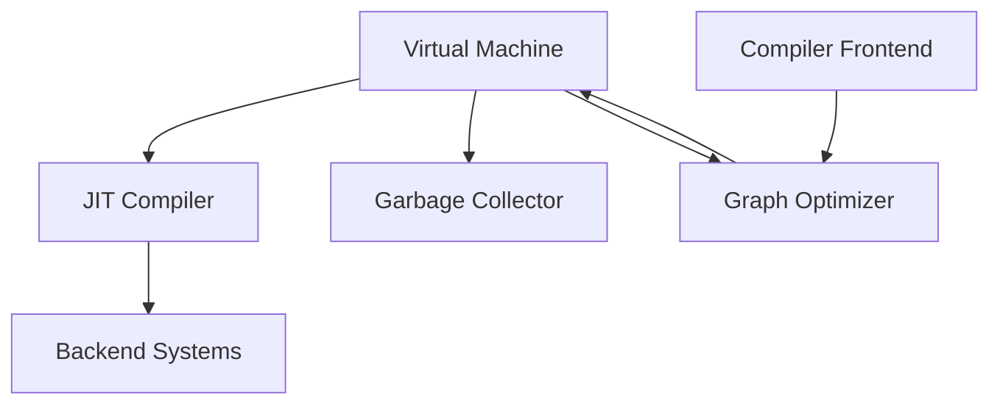

# BDI Kernel Components

## Overview

This document provides detailed descriptions of all major components in the BDI Kernel system, their responsibilities, interfaces, and interactions.

## Component Catalog

### 1. Virtual Machine (VM)

**Location**: `C/vm/`

**Purpose**: Execute BDI bytecode in an interpreted or JIT-compiled manner.

**Key Files**:
- `vm.h` / `vm.c` - Enhanced VM with JIT and GC integration
- `bci_vm.h` / `bci_vm.c` - Base VM implementation
- `bci_chunk.h` / `bci_chunk.c` - Bytecode chunk management

**Responsibilities**:
- Bytecode interpretation
- Stack management
- Instruction execution
- Integration with JIT compiler
- Integration with garbage collector
- Execution profiling and statistics

**Public API**:
```c
// VM lifecycle
EnhancedVM* enhanced_vm_create(size_t heap_size);
void enhanced_vm_destroy(EnhancedVM* vm);

// Execution
bool enhanced_vm_execute(EnhancedVM* vm, const Chunk* chunk);
EnhancedVmResult enhanced_vm_execute_with_result(EnhancedVM* vm, const Chunk* chunk);

// Configuration
void enhanced_vm_enable_jit(EnhancedVM* vm, bool enable);
void enhanced_vm_enable_gc(EnhancedVM* vm, bool enable);
```

**Dependencies**:
- JIT Compiler (for hot path compilation)
- Garbage Collector (for memory management)
- Graph Executor (for graph-based execution)

**Performance Characteristics**:
- Interpreted execution: ~10-50x slower than native
- With JIT: Near-native performance
- Memory overhead: ~1-2 KB per VM instance

---

### 2. JIT Compiler

**Location**: `C/vm/jit/`

**Purpose**: Dynamically compile hot code paths to native machine code.

**Key Files**:
- `jit_compiler.h` / `jit_compiler.c` - Main JIT compiler
- `hot_path.h` / `hot_path.c` - Hot path detection
- `tiered_compilation.h` / `tiered_compilation.c` - Tiered compilation manager
- `bytecode_compiler.h` / `bytecode_compiler.c` - Bytecode to native compilation

**Responsibilities**:
- Hot path detection and profiling
- Bytecode to native code compilation
- Tiered compilation management
- Code cache management
- Optimization level control

**Public API**:
```c
// JIT lifecycle
JITCompiler* jit_compiler_create(void);
void jit_compiler_destroy(JITCompiler* compiler);

// Compilation
JITStatus jit_compiler_compile_function(
    JITCompiler* compiler,
    const Chunk* chunk,
    uint32_t function_id,
    JITTier tier,
    CompiledCode** out_code
);

// Configuration
void jit_compiler_set_optimization_level(JITCompiler* compiler, uint32_t level);
void jit_compiler_enable_profiling(JITCompiler* compiler, bool enable);
```

**Compilation Tiers**:
1. **Tier 0**: Interpreter (no compilation)
2. **Tier 1**: Baseline JIT (fast compilation, minimal optimization)
3. **Tier 2**: Optimized JIT (full LLVM optimization)

**Dependencies**:
- LLVM (for code generation and optimization)
- VM (for execution context)
- Hot Path Detector (for profiling)

**Performance Characteristics**:
- Baseline compilation: 1-10 ms per function
- Optimized compilation: 10-100 ms per function
- Memory overhead: 10-50 MB for LLVM infrastructure

---

### 3. Garbage Collector

**Location**: `C/vm/gc/`

**Purpose**: Automatic memory management with generational collection.

**Key Files**:
- `generational_gc.h` / `generational_gc.c` - Generational GC implementation
- `mark_sweep.h` / `mark_sweep.c` - Mark-and-sweep collector

**Responsibilities**:
- Automatic memory allocation and deallocation
- Generational collection (young/old generations)
- Write barrier management
- Root set tracking
- Memory compaction (optional)

**Public API**:
```c
// GC lifecycle
GenerationalGC* generational_gc_create(size_t nursery_size, size_t old_gen_size);
void generational_gc_destroy(GenerationalGC* gc);

// Allocation
GCObject* gc_alloc(GenerationalGC* gc, size_t size, uint32_t type_id);

// Collection
void gc_collect(GenerationalGC* gc);
void gc_collect_young(GenerationalGC* gc);
void gc_collect_full(GenerationalGC* gc);

// Root management
void gc_add_root(GenerationalGC* gc, GCObject** root);
void gc_remove_root(GenerationalGC* gc, GCObject** root);
```

**Collection Strategy**:
- **Young Generation**: Frequent, fast collection (copy collector)
- **Old Generation**: Infrequent, thorough collection (mark-sweep)
- **Write Barriers**: Track old-to-young references

**Dependencies**:
- VM (for execution context)
- Memory allocator (for heap management)

**Performance Characteristics**:
- Young collection: 1-10 ms
- Full collection: 10-100 ms
- Memory overhead: 10-20% for metadata

---

### 4. Graph Optimizer

**Location**: `C/vm/graph/`

**Purpose**: Optimize intermediate representation graphs.

**Key Files**:
- `graph_optimizer.h` / `graph_optimizer.c` - Main optimizer
- `graph.h` / `graph.c` - Graph data structure
- `graph_builder.h` / `graph_builder.c` - Graph construction
- `graph_executor.h` / `graph_executor.c` - Graph execution

**Responsibilities**:
- Graph-based IR optimization
- Dead code elimination
- Constant folding and propagation
- Common subexpression elimination
- Loop optimization
- Inlining

**Public API**:
```c
// Graph lifecycle
Graph* graph_create(void);
void graph_destroy(Graph* graph);

// Optimization
void graph_optimize(Graph* graph, OptimizationLevel level);
void graph_optimize_pass(Graph* graph, OptimizationPass pass);

// Execution
GraphExecutionResult graph_execute(Graph* graph, GraphExecutor* executor);
```

**Optimization Passes**:
1. Dead code elimination
2. Constant folding
3. Common subexpression elimination
4. Loop invariant code motion
5. Inlining
6. Strength reduction

**Dependencies**:
- Compiler frontend (for IR generation)
- VM (for execution)

**Performance Characteristics**:
- Optimization time: 1-50 ms per pass
- Memory overhead: 100 KB - 1 MB per graph

---

### 5. Compiler Frontend

**Location**: `C/compiler/`

**Purpose**: Transform source code into intermediate representation.

#### 5.1 Lexer

**Location**: `C/compiler/lexer/`

**Key Files**:
- `bci_lexer.h` / `bci_lexer.c` - Lexical analyzer
- `bci_token.h` - Token definitions

**Responsibilities**:
- Tokenization of source code
- Keyword recognition
- Operator parsing
- Literal value extraction

**Public API**:
```c
Lexer* lexer_create(const char* source);
Token lexer_next_token(Lexer* lexer);
void lexer_destroy(Lexer* lexer);
```

#### 5.2 Parser

**Location**: `C/compiler/parser/`

**Key Files**:
- `bci_parser.h` / `bci_parser.c` - Parser implementation
- `bci_parser_extended.h` / `bci_parser_extended.c` - Extended parsing

**Responsibilities**:
- AST construction from tokens
- Syntax validation
- Error recovery
- Operator precedence handling

**Public API**:
```c
Parser* parser_create(Lexer* lexer);
ASTNode* parser_parse(Parser* parser);
void parser_destroy(Parser* parser);
```

#### 5.3 Semantic Analyzer

**Location**: `C/compiler/semantic_analyzer/`

**Key Files**:
- `bci_analyzer.h` / `bci_analyzer.c` - Semantic analysis
- `bci_symbol.h` / `bci_symbol.c` - Symbol table
- `bci_type_inference.h` / `bci_type_inference.c` - Type inference
- `bci_cfg.h` / `bci_cfg.c` - Control flow graph
- `bci_escape.h` / `bci_escape.c` - Escape analysis
- `bci_lifetime.h` / `bci_lifetime.c` - Lifetime analysis

**Responsibilities**:
- Type checking and inference
- Symbol resolution
- Scope management
- Control flow analysis
- Data flow analysis
- Escape analysis

**Public API**:
```c
SemanticAnalyzer* analyzer_create(void);
bool analyzer_analyze(SemanticAnalyzer* analyzer, ASTNode* ast);
void analyzer_destroy(SemanticAnalyzer* analyzer);
```

---

### 6. Code Generator

**Location**: `C/codegen/`

**Purpose**: Generate bytecode from intermediate representation.

**Key Files**:
- `bci_codegen.h` / `bci_codegen.c` - Bytecode generation

**Responsibilities**:
- Bytecode emission
- Register allocation
- Instruction selection
- Code layout optimization

**Public API**:
```c
CodeGenerator* codegen_create(void);
Chunk* codegen_generate(CodeGenerator* codegen, Graph* graph);
void codegen_destroy(CodeGenerator* codegen);
```

---

### 7. Backend Systems

**Location**: `C/kernel/backend/`

**Purpose**: Generate code for specific hardware targets.

#### 7.1 CPU Backend

**Location**: `C/kernel/backend/cpu/`

**Key Files**:
- `cpu_backend.h` / `cpu_backend.c` - CPU code generation

**Responsibilities**:
- Native x86/ARM code generation
- Register allocation
- Instruction scheduling
- Peephole optimization

#### 7.2 GPU Backend

**Location**: `C/kernel/backend/gpu/`

**Key Files**:
- `gpu_backend.h` / `gpu_backend.c` - GPU code generation
- `gpu_backend_opencl.h` / `gpu_backend_opencl.c` - OpenCL backend

**Responsibilities**:
- OpenCL/CUDA code generation
- Kernel optimization
- Memory transfer management
- Parallel execution

#### 7.3 FPGA Backend

**Location**: `C/kernel/backend/fpga/`

**Key Files**:
- `fpga_backend.h` / `fpga_backend.c` - FPGA code generation
- `fpga_verilog.h` / `fpga_verilog.c` - Verilog generation

**Responsibilities**:
- Verilog code generation
- Hardware synthesis
- Timing optimization
- Resource allocation

---

### 8. Kernel Systems

**Location**: `C/kernel/`

**Purpose**: Provide kernel-level functionality and system management.

#### 8.1 Scheduler

**Location**: `C/kernel/scheduler/`

**Key Files**:
- `scheduler.h` / `scheduler.c` - Main scheduler
- `priority_scheduler.h` / `priority_scheduler.c` - Priority scheduling
- `wavefront_scheduler.h` / `wavefront_scheduler.c` - Wavefront scheduling
- `worksteal_scheduler.h` / `worksteal_scheduler.c` - Work-stealing scheduler

**Responsibilities**:
- Task scheduling
- Load balancing
- Priority management
- Thread pool management

#### 8.2 Device Management

**Location**: `C/kernel/device/`

**Key Files**:
- `device.h` / `device.c` - Device abstraction

**Responsibilities**:
- Device enumeration
- Device capability detection
- Device resource management

#### 8.3 File System

**Location**: `C/kernel/file/`

**Key Files**:
- `fs.h` / `fs.c` - File system interface

**Responsibilities**:
- File I/O operations
- Path resolution
- File metadata management

---

### 9. AI Trainer

**Location**: `C/trainer/`

**Purpose**: Machine learning and neural network training.

**Key Files**:
- `trainer.h` / `trainer.c` - Main trainer
- `autodiff/` - Automatic differentiation
- `optimizers/` - Optimization algorithms (SGD, Adam, RMSprop)
- `loss/` - Loss functions
- `metrics/` - Training metrics

**Responsibilities**:
- Neural network training
- Automatic differentiation
- Optimization algorithms
- Loss computation
- Metric tracking

---

### 10. HAM (Hierarchical Adaptive Memory)

**Location**: `C/kernel/ham/`

**Purpose**: Intelligent memory management and optimization.

**Key Files**:
- `ham.h` / `ham.c` - Main HAM system
- `compression/` - Memory compression
- `entropy/` - Entropy-based optimization
- `numa/` - NUMA-aware allocation
- `tier/` - Memory tier management

**Responsibilities**:
- Hierarchical memory management
- Adaptive memory allocation
- Compression and decompression
- NUMA optimization
- Memory tier management

---

## Component Interactions

### Compilation Flow

```
Source Code
    ↓
Lexer → Tokens
    ↓
Parser → AST
    ↓
Semantic Analyzer → Typed AST
    ↓
Graph Builder → IR Graph
    ↓
Graph Optimizer → Optimized IR
    ↓
Code Generator → Bytecode
```

### Execution Flow

```
Bytecode
    ↓
VM Interpreter
    ↓
Hot Path Detector → Profile Data
    ↓
JIT Compiler → Native Code
    ↓
Native Execution
```

### Memory Management Flow

```
Allocation Request
    ↓
Garbage Collector
    ↓
Heap Manager
    ↓
Memory Block
```

## Component Dependencies



## Module Organization

### Core Modules

- **VM**: Virtual machine execution
- **JIT**: Just-in-time compilation
- **GC**: Garbage collection
- **Graph**: Graph optimization

### Compiler Modules

- **Lexer**: Tokenization
- **Parser**: Syntax analysis
- **Semantic**: Semantic analysis
- **Codegen**: Code generation

### Backend Modules

- **CPU**: CPU code generation
- **GPU**: GPU code generation
- **FPGA**: FPGA code generation

### System Modules

- **Scheduler**: Task scheduling
- **Device**: Device management
- **File**: File system

### AI Modules

- **Trainer**: Neural network training
- **Autodiff**: Automatic differentiation
- **Optimizers**: Optimization algorithms

## Testing Components

**Location**: `C/tests/`

**Test Categories**:
- **Unit Tests**: Component-level testing
- **Integration Tests**: Component interaction testing
- **Stress Tests**: Performance and scalability testing
- **Regression Tests**: Bug prevention testing

---

## References

- [System Design](system-design.md)
- [VM Architecture](vm-architecture.md)
- [JIT Architecture](jit-architecture.md)
- [Graph Optimizer](graph-optimizer.md)
- [Memory Model](memory-model.md)
- [API Documentation](../api/html/index.html)

---

**BDI Kernel Team**  
**October 2024**
