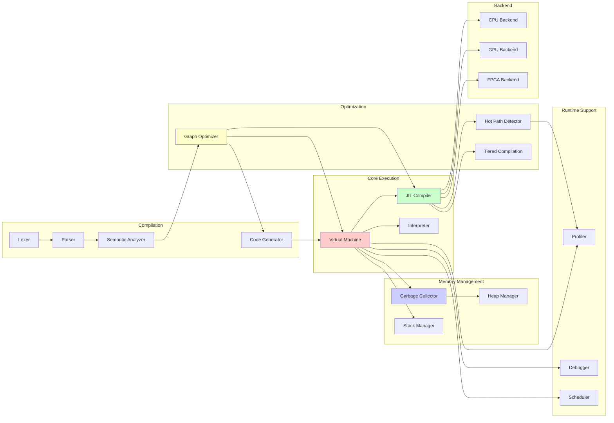

# Component Diagram

This diagram shows the major components of the BDI Kernel and their relationships.

## Component Relationships



## Component Dependencies

### Virtual Machine
**Depends on**:
- Interpreter (for bytecode execution)
- JIT Compiler (for native code execution)
- Garbage Collector (for memory management)
- Stack Manager (for call stack)

**Used by**:
- Graph Optimizer (for execution)
- Profiler (for statistics)
- Debugger (for debugging)

### JIT Compiler
**Depends on**:
- Hot Path Detector (for profiling)
- Tiered Compilation Manager (for tier selection)
- CPU/GPU/FPGA Backends (for code generation)

**Used by**:
- Virtual Machine (for hot path execution)

### Garbage Collector
**Depends on**:
- Heap Manager (for memory allocation)

**Used by**:
- Virtual Machine (for object allocation)

### Graph Optimizer
**Depends on**:
- Nothing (standalone optimization)

**Used by**:
- Code Generator (for bytecode generation)
- JIT Compiler (for optimization)

### Compiler Frontend
**Components**:
- Lexer → Parser → Semantic Analyzer

**Output**:
- Graph-based IR for optimization

### Backend Systems
**Components**:
- CPU Backend (x86/ARM)
- GPU Backend (OpenCL/CUDA)
- FPGA Backend (Verilog)

**Used by**:
- JIT Compiler (for code generation)

## Interaction Patterns

### Compilation Flow
```
Lexer → Parser → Semantic → Graph → Codegen → VM
```

### Execution Flow
```
VM → Interpreter (cold code)
VM → JIT → Backend → Native Execution (hot code)
```

### Memory Management Flow
```
VM → GC → Heap Manager
```

### Optimization Flow
```
Graph Optimizer → IR → Codegen → VM
```

## Module Organization

### Core Modules
- `vm/` - Virtual machine implementation
- `jit/` - JIT compiler
- `gc/` - Garbage collector
- `graph/` - Graph optimizer

### Compiler Modules
- `compiler/lexer/` - Lexical analysis
- `compiler/parser/` - Syntax analysis
- `compiler/semantic_analyzer/` - Semantic analysis
- `codegen/` - Code generation

### Backend Modules
- `kernel/backend/cpu/` - CPU code generation
- `kernel/backend/gpu/` - GPU code generation
- `kernel/backend/fpga/` - FPGA code generation

### Support Modules
- `kernel/scheduler/` - Task scheduling
- `kernel/device/` - Device management
- `tests/` - Testing infrastructure

---

[Back to Architecture Overview](../README.md)
