# Data Flow Diagram

This diagram shows how data flows through the BDI Kernel system from source code to execution.

## Complete Data Flow

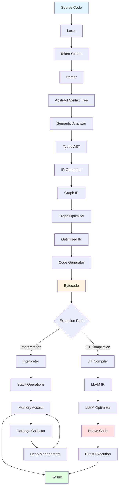

## Detailed Data Transformations

### 1. Source to Tokens

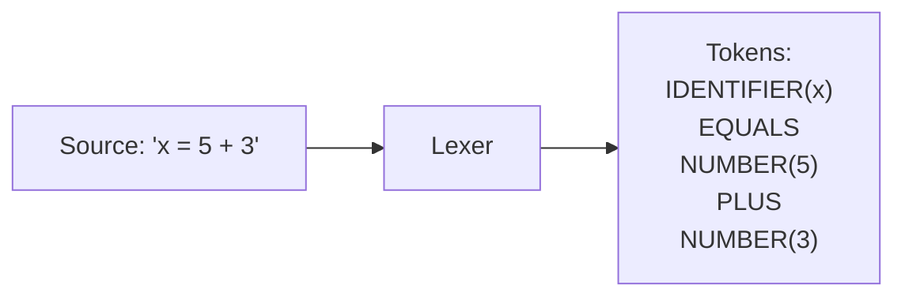

### 2. Tokens to AST

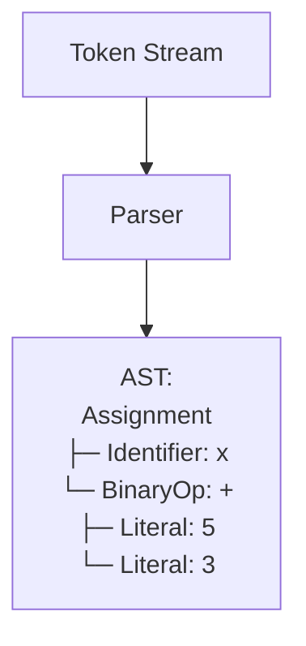

### 3. AST to Typed AST

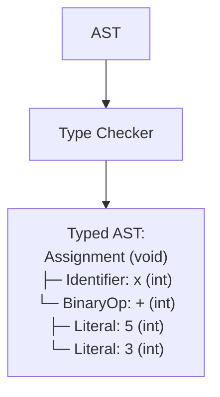

### 4. AST to Graph IR

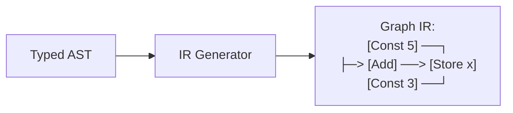

### 5. Graph Optimization

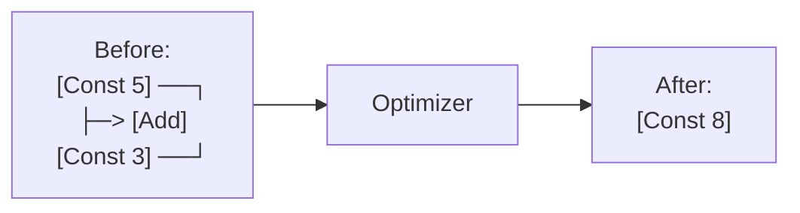

### 6. IR to Bytecode

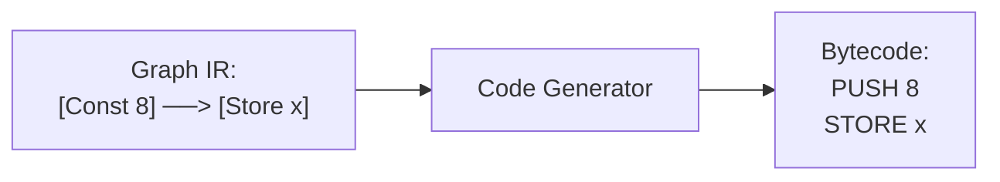

### 7. Bytecode to Native Code

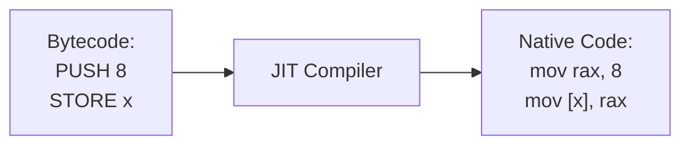

## Data Structures

### Token Structure
```c
typedef struct {
    TokenType type;
    const char* lexeme;
    int line;
    int column;
} Token;
```

### AST Node Structure
```c
typedef struct ASTNode {
    NodeType type;
    TypeInfo* type_info;
    SourceLocation location;
    union {
        double literal_value;
        char* identifier;
        struct {
            struct ASTNode* left;
            struct ASTNode* right;
        } binary_op;
    } data;
} ASTNode;
```

### Graph Node Structure
```c
typedef struct GraphNode {
    uint32_t id;
    NodeType type;
    struct GraphNode** inputs;
    struct GraphNode** outputs;
    TypeInfo* type;
} GraphNode;
```

### Bytecode Instruction
```c
typedef struct {
    OpCode opcode;
    uint8_t operands[8];
} Instruction;
```

## Memory Flow

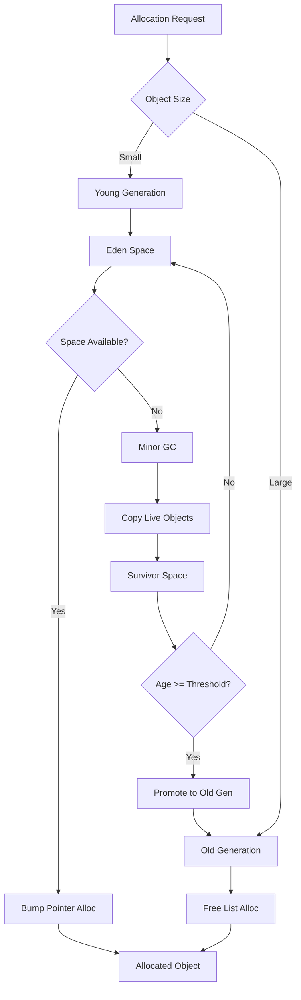

## Control Flow

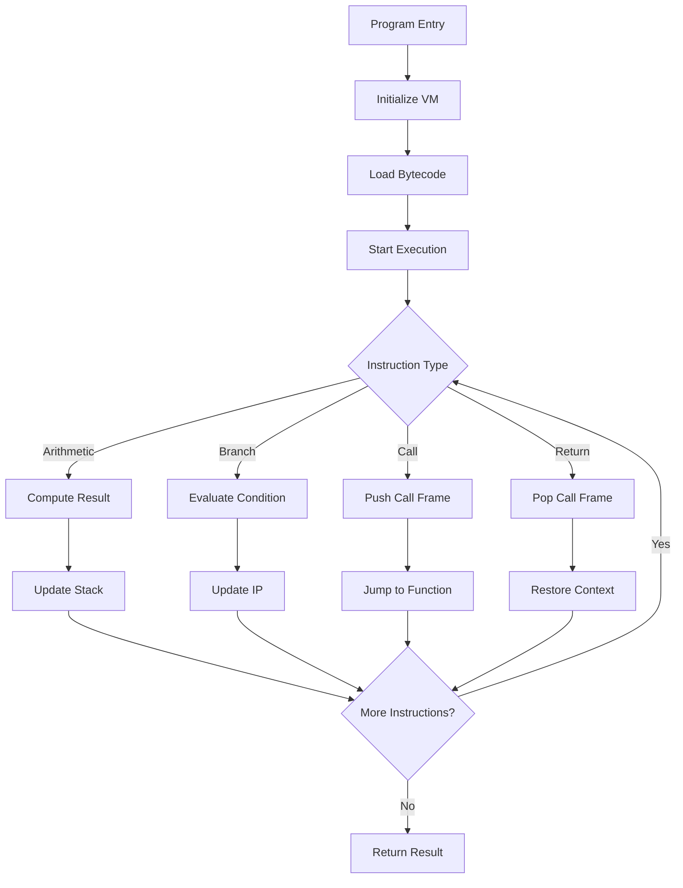

## Optimization Data Flow

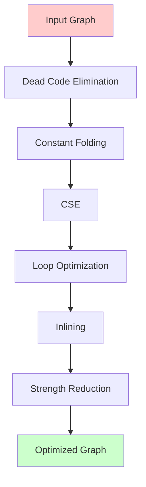

## Profiling Data Flow

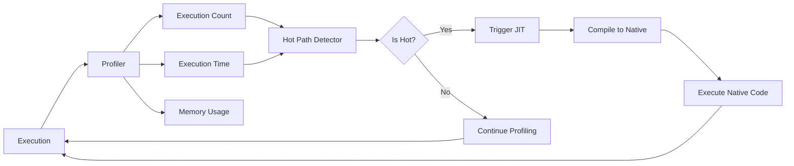

---

[Back to Architecture Overview](../README.md)
