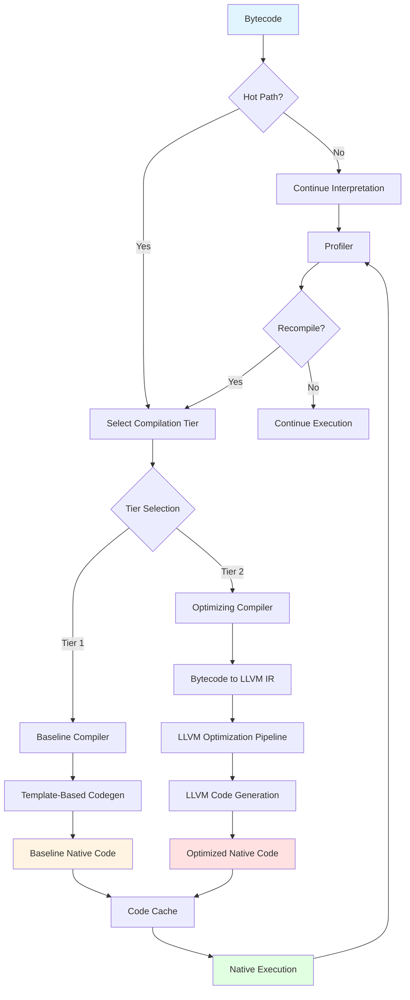
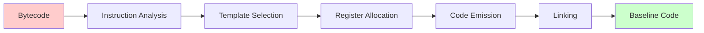
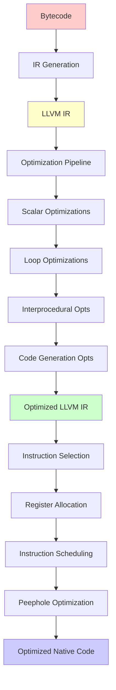
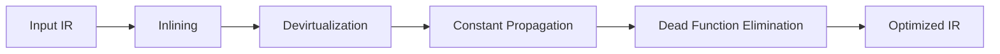
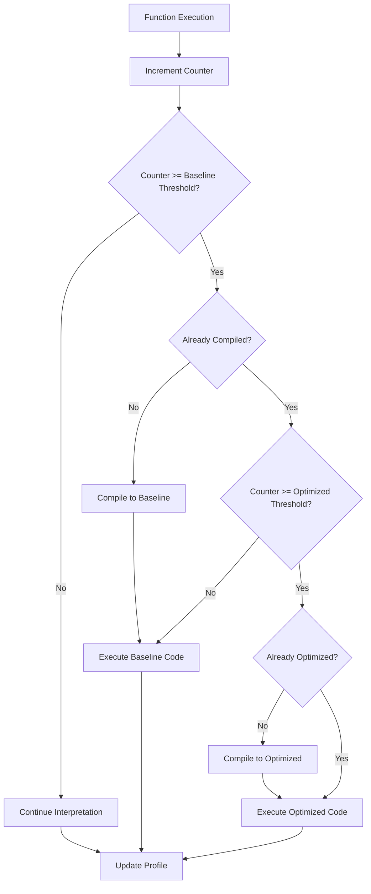
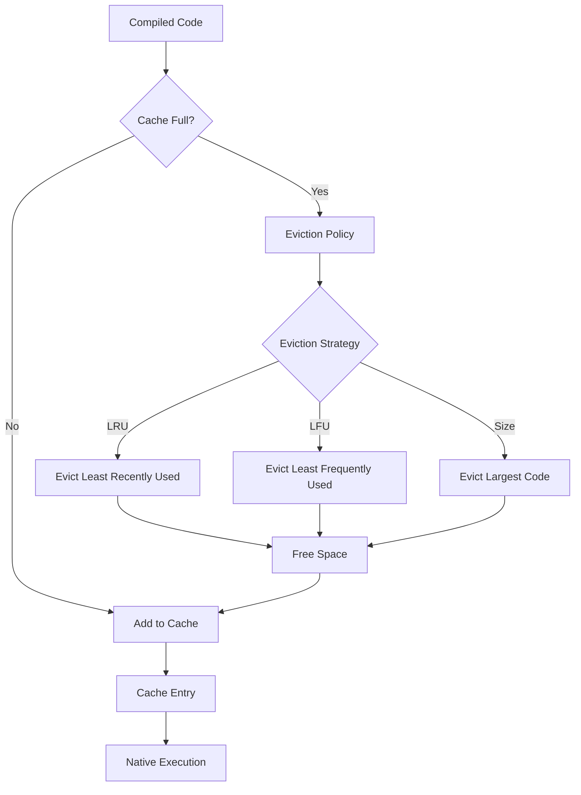
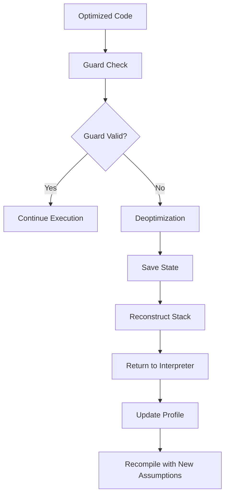

# JIT Compilation Pipeline

This diagram illustrates the JIT compilation pipeline from bytecode to native code.

## Complete JIT Pipeline



## Tier 1: Baseline Compilation



### Baseline Compilation Steps

1. **Instruction Analysis**
   - Parse bytecode instructions
   - Identify instruction patterns
   - Determine stack effects

2. **Template Selection**
   - Select code template for each instruction
   - Simple 1:1 or 1:N mapping
   - No complex optimizations

3. **Register Allocation**
   - Simple register allocation
   - Stack-based with register caching
   - Minimal register pressure

4. **Code Emission**
   - Generate native instructions
   - Direct template instantiation
   - Inline constants

5. **Linking**
   - Link with runtime support
   - Resolve external references
   - Generate call stubs

### Example: Baseline Compilation

```
Bytecode:           Template:              Native Code:
─────────────────────────────────────────────────────────
PUSH 5              mov reg, imm           mov rax, 5
                    push reg               push rax

PUSH 3              mov reg, imm           mov rax, 3
                    push reg               push rax

ADD                 pop reg2               pop rbx
                    pop reg1               pop rax
                    add reg1, reg2         add rax, rbx
                    push reg1              push rax

RETURN              pop reg                pop rax
                    ret                    ret
```

## Tier 2: Optimizing Compilation



### LLVM Optimization Passes

#### Scalar Optimizations


#### Loop Optimizations


#### Interprocedural Optimizations


### Example: Optimizing Compilation

```
Bytecode:
─────────
PUSH 5
PUSH 3
ADD
RETURN

↓ IR Generation

LLVM IR (Initial):
──────────────────
define double @function() {
entry:
  %0 = alloca double
  %1 = alloca double
  store double 5.0, double* %0
  store double 3.0, double* %1
  %2 = load double, double* %0
  %3 = load double, double* %1
  %4 = fadd double %2, %3
  ret double %4
}

↓ Optimization

LLVM IR (Optimized):
────────────────────
define double @function() {
entry:
  ret double 8.0
}

↓ Code Generation

Native Code:
────────────
mov rax, 0x4020000000000000  ; 8.0 in IEEE 754
ret
```

## Hot Path Detection



### Threshold Values

```
Tier 0 (Interpreter):
  - Threshold: 0
  - Action: Profile execution

Tier 1 (Baseline JIT):
  - Threshold: 100 executions
  - Action: Fast compilation

Tier 2 (Optimized JIT):
  - Threshold: 1000 executions
  - Action: Full optimization
```

## Code Cache Management



### Cache Structure

```
Code Cache:
┌─────────────────────────────────────┐
│  Function ID: 1                     │
│  Tier: Baseline                     │
│  Code Size: 256 bytes               │
│  Execution Count: 150               │
│  Last Access: timestamp             │
│  Native Code: [...]                 │
├─────────────────────────────────────┤
│  Function ID: 2                     │
│  Tier: Optimized                    │
│  Code Size: 512 bytes               │
│  Execution Count: 5000              │
│  Last Access: timestamp             │
│  Native Code: [...]                 │
├─────────────────────────────────────┤
│  ...                                │
└─────────────────────────────────────┘
```

## Performance Characteristics

### Compilation Time

```mermaid
gantt
    title JIT Compilation Time
    dateFormat X
    axisFormat %L ms
    
    section Baseline
    Analysis       :0, 1
    Template       :1, 2
    Register Alloc :2, 1
    Code Emission  :3, 3
    Linking        :6, 2
    
    section Optimized
    IR Generation  :0, 5
    Optimization   :5, 40
    Code Gen       :45, 30
    Linking        :75, 5
```



### Execution Performance

| Tier | Compilation Time | Execution Speed | Use Case |
|------|-----------------|----------------|----------|
| Interpreter | 0 ms | 1x (baseline) | Cold code |
| Baseline JIT | 1-10 ms | 5-10x | Warm code |
| Optimized JIT | 10-100 ms | 20-50x | Hot code |

## Deoptimization



### Guard Types

1. **Type Guards**: Check object types
2. **Value Guards**: Check specific values
3. **Range Guards**: Check value ranges
4. **Null Guards**: Check for null pointers

---

[Back to Architecture Overview](../README.md)
