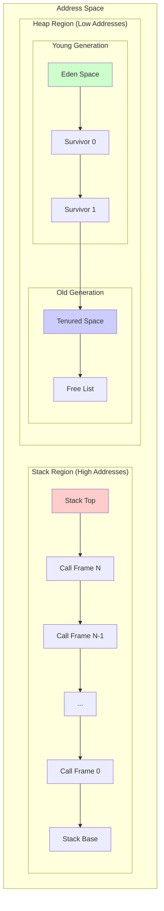

# Memory Layout Diagram

This diagram illustrates the memory organization in the BDI Kernel.

## Complete Memory Layout



## Detailed Stack Layout

```
High Addresses
┌─────────────────────────────────────┐
│         Stack Top (SP)              │ ← Current stack pointer
├─────────────────────────────────────┤
│                                     │
│      Call Frame N (Current)         │
│  ┌───────────────────────────────┐ │
│  │ Return Address                │ │
│  ├───────────────────────────────┤ │
│  │ Previous Frame Pointer        │ │
│  ├───────────────────────────────┤ │
│  │ Local Variables               │ │
│  │  - var_n                      │ │
│  │  - var_n-1                    │ │
│  │  - ...                        │ │
│  │  - var_0                      │ │
│  ├───────────────────────────────┤ │
│  │ Temporary Values              │ │
│  │  - temp_m                     │ │
│  │  - temp_m-1                   │ │
│  │  - ...                        │ │
│  │  - temp_0                     │ │
│  └───────────────────────────────┘ │
├─────────────────────────────────────┤
│      Call Frame N-1                 │
│  ┌───────────────────────────────┐ │
│  │ ...                           │ │
│  └───────────────────────────────┘ │
├─────────────────────────────────────┤
│             ...                     │
├─────────────────────────────────────┤
│      Call Frame 0 (Main)            │
│  ┌───────────────────────────────┐ │
│  │ ...                           │ │
│  └───────────────────────────────┘ │
├─────────────────────────────────────┤
│         Stack Base                  │
└─────────────────────────────────────┘
Low Addresses
```

## Detailed Heap Layout

```
Low Addresses
┌─────────────────────────────────────────────────┐
│              Young Generation                    │
│  ┌───────────────────────────────────────────┐ │
│  │           Eden Space                      │ │
│  │  ┌─────────────────────────────────────┐ │ │
│  │  │ Allocation Pointer (bump pointer)   │ │ │
│  │  ├─────────────────────────────────────┤ │ │
│  │  │ Allocated Objects                   │ │ │
│  │  │  [Obj1][Obj2][Obj3]...[ObjN]       │ │ │
│  │  ├─────────────────────────────────────┤ │ │
│  │  │ Free Space                          │ │ │
│  │  └─────────────────────────────────────┘ │ │
│  ├───────────────────────────────────────────┤ │
│  │         Survivor Space 0                  │ │
│  │  ┌─────────────────────────────────────┐ │ │
│  │  │ Survived Objects (age 1-2)          │ │ │
│  │  │  [Obj][Obj][Obj]...                 │ │ │
│  │  └─────────────────────────────────────┘ │ │
│  ├───────────────────────────────────────────┤ │
│  │         Survivor Space 1                  │ │
│  │  ┌─────────────────────────────────────┐ │ │
│  │  │ Survived Objects (age 1-2)          │ │ │
│  │  │  [Obj][Obj][Obj]...                 │ │ │
│  │  └─────────────────────────────────────┘ │ │
│  └───────────────────────────────────────────┘ │
├─────────────────────────────────────────────────┤
│              Old Generation                      │
│  ┌───────────────────────────────────────────┐ │
│  │         Tenured Space                     │ │
│  │  ┌─────────────────────────────────────┐ │ │
│  │  │ Long-lived Objects (age >= 3)       │ │ │
│  │  │  [Obj][Free][Obj][Obj][Free]...     │ │ │
│  │  └─────────────────────────────────────┘ │ │
│  ├───────────────────────────────────────────┤ │
│  │         Free List                         │ │
│  │  ┌─────────────────────────────────────┐ │ │
│  │  │ Free Block 1 (size: 1024)           │ │ │
│  │  │ Free Block 2 (size: 2048)           │ │ │
│  │  │ Free Block 3 (size: 512)            │ │ │
│  │  │ ...                                  │ │ │
│  │  └─────────────────────────────────────┘ │ │
│  └───────────────────────────────────────────┘ │
└─────────────────────────────────────────────────┘
High Addresses
```

## Object Memory Layout

### Object Header

```
┌─────────────────────────────────────┐
│         GC Object Header             │
│  ┌───────────────────────────────┐  │
│  │ Next Pointer (8 bytes)        │  │ ← For free list
│  ├───────────────────────────────┤  │
│  │ Type ID (4 bytes)             │  │ ← Object type
│  ├───────────────────────────────┤  │
│  │ Size (4 bytes)                │  │ ← Object size
│  ├───────────────────────────────┤  │
│  │ Age (1 byte)                  │  │ ← GC age
│  ├───────────────────────────────┤  │
│  │ Marked (1 byte)               │  │ ← GC mark bit
│  ├───────────────────────────────┤  │
│  │ Generation (1 byte)           │  │ ← 0=young, 1=old
│  ├───────────────────────────────┤  │
│  │ Padding (1 byte)              │  │ ← Alignment
│  └───────────────────────────────┘  │
├─────────────────────────────────────┤
│         Object Data                  │
│  ┌───────────────────────────────┐  │
│  │ Field 1                       │  │
│  ├───────────────────────────────┤  │
│  │ Field 2                       │  │
│  ├───────────────────────────────┤  │
│  │ ...                           │  │
│  ├───────────────────────────────┤  │
│  │ Field N                       │  │
│  └───────────────────────────────┘  │
└─────────────────────────────────────┘

Total Header Size: 24 bytes (on 64-bit systems)
Alignment: 8 bytes
```

## Memory Allocation Flow

```mermaid
flowchart TD
    A[Allocation Request] --> B{Object Size}
    
    B -->|< 1 KB| C[Young Generation]
    B -->|>= 1 KB| D[Old Generation]
    
    C --> E{Eden Space Available?}
    E -->|Yes| F[Bump Pointer Allocation]
    E -->|No| G[Minor GC]
    
    F --> H[Return Object]
    
    G --> I[Copy Live Objects]
    I --> J[Survivor Space]
    J --> K{Age >= 3?}
    
    K -->|Yes| L[Promote to Old Gen]
    K -->|No| M[Keep in Young Gen]
    
    L --> D
    M --> C
    
    D --> N{Free Block Available?}
    N -->|Yes| O[Free List Allocation]
    N -->|No| P[Major GC]
    
    O --> H
    
    P --> Q[Mark and Sweep]
    Q --> R[Compact (optional)]
    R --> D
```

## Card Table for Write Barriers

```
Old Generation Memory:
┌────────┬────────┬────────┬────────┬────────┐
│ Card 0 │ Card 1 │ Card 2 │ Card 3 │ Card 4 │
│ 512 B  │ 512 B  │ 512 B  │ 512 B  │ 512 B  │
└────────┴────────┴────────┴────────┴────────┘
    ↓        ↓        ↓        ↓        ↓
Card Table:
┌────┬────┬────┬────┬────┐
│ C  │ D  │ C  │ C  │ D  │  C = Clean, D = Dirty
└────┴────┴────┴────┴────┘

Dirty cards contain old-to-young references
```

## Memory Regions and Sizes

### Default Configuration

```
Total Heap: 1 MB
├─ Young Generation: 256 KB (25%)
│  ├─ Eden: 192 KB (75% of young)
│  ├─ Survivor 0: 32 KB (12.5% of young)
│  └─ Survivor 1: 32 KB (12.5% of young)
└─ Old Generation: 768 KB (75%)
   ├─ Tenured Space: 768 KB
   └─ Card Table: ~1.5 KB (0.2% overhead)
```

### Memory Overhead

```
Component                 Size        Percentage
─────────────────────────────────────────────────
Object Headers           24 B/obj     ~10-15%
Card Table              0.2%          0.2%
Free List Metadata      1-5%          1-5%
GC Metadata             1-2%          1-2%
─────────────────────────────────────────────────
Total Overhead                        ~12-22%
```

## Memory Access Patterns

### Stack Access (Fast)
```
Access Time: 1-2 CPU cycles
Cache Hit Rate: 95-99%
Pattern: Sequential, predictable
```

### Young Gen Access (Fast)
```
Access Time: 2-5 CPU cycles
Cache Hit Rate: 80-90%
Pattern: Sequential allocation, random access
```

### Old Gen Access (Moderate)
```
Access Time: 5-20 CPU cycles
Cache Hit Rate: 60-80%
Pattern: Random access, fragmented
```

---

[Back to Architecture Overview](../README.md)
