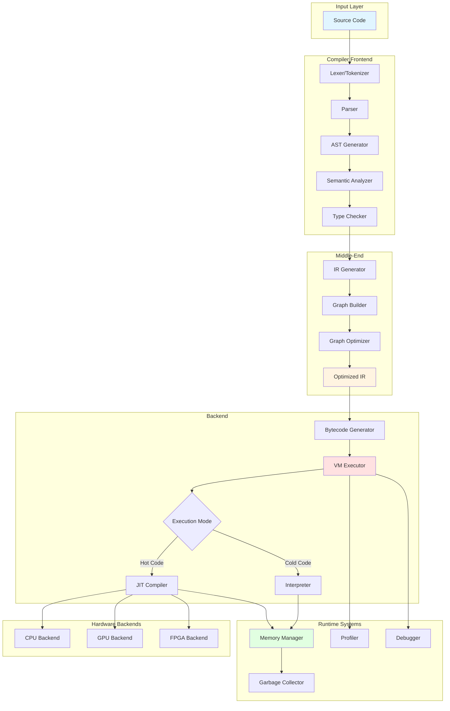

# System Overview Diagram

This diagram provides a high-level overview of the BDI Kernel system architecture.

## System Architecture

## Component Descriptions

### Input Layer
- **Source Code**: BDI source programs

### Compiler Frontend
- **Lexer**: Tokenizes source code
- **Parser**: Builds Abstract Syntax Tree (AST)
- **Semantic Analyzer**: Performs semantic analysis
- **Type Checker**: Validates and infers types

### Middle-End
- **IR Generator**: Converts AST to intermediate representation
- **Graph Builder**: Constructs graph-based IR
- **Graph Optimizer**: Optimizes IR graph
- **Optimized IR**: Final optimized representation

### Backend
- **Bytecode Generator**: Generates bytecode from IR
- **VM Executor**: Executes bytecode
- **Interpreter**: Interprets bytecode directly
- **JIT Compiler**: Compiles hot paths to native code

### Runtime Systems
- **Memory Manager**: Manages heap allocation
- **Garbage Collector**: Automatic memory reclamation
- **Profiler**: Tracks execution statistics
- **Debugger**: Debugging support

### Hardware Backends
- **CPU Backend**: Native x86/ARM code generation
- **GPU Backend**: OpenCL/CUDA code generation
- **FPGA Backend**: Verilog code generation

## Data Flow

1. **Source → Frontend**: Source code is tokenized, parsed, and analyzed
2. **Frontend → Middle-End**: AST is converted to graph-based IR
3. **Middle-End → Backend**: Optimized IR is converted to bytecode
4. **Backend → Execution**: Bytecode is interpreted or JIT-compiled
5. **Execution → Runtime**: Runtime systems manage memory and profiling

## Execution Modes

### Interpreted Execution
- Direct bytecode interpretation
- No compilation overhead
- Slower execution (10-50x vs native)
- Used for cold code

### JIT-Compiled Execution
- Dynamic compilation to native code
- Compilation overhead (1-100ms)
- Fast execution (0.8-1.2x native)
- Used for hot code

---

[Back to Architecture Overview](../README.md)
