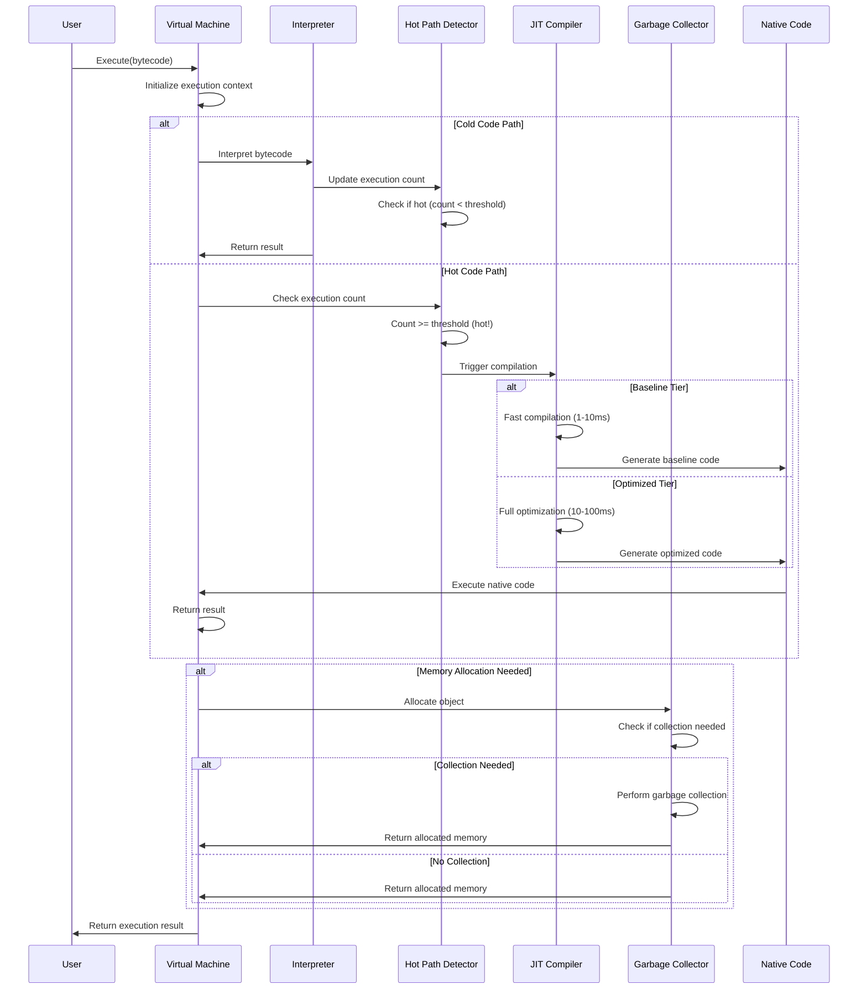
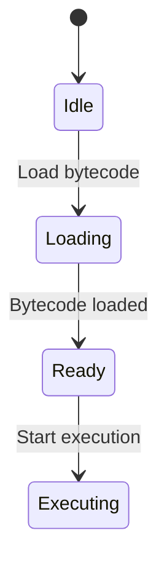
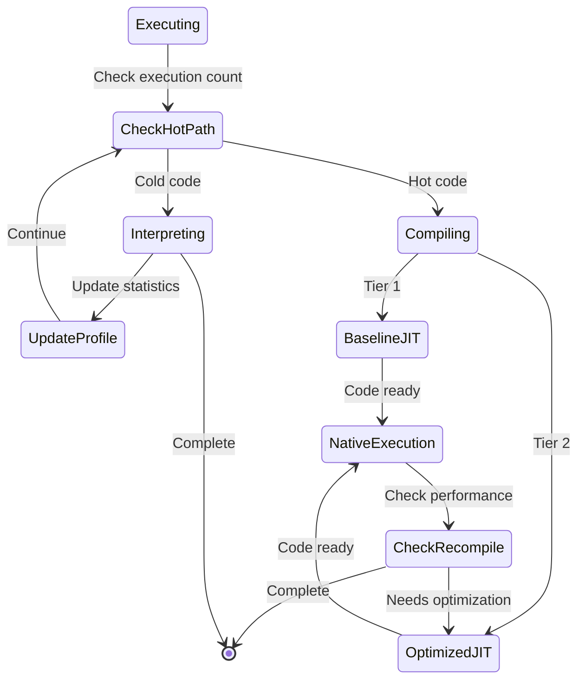
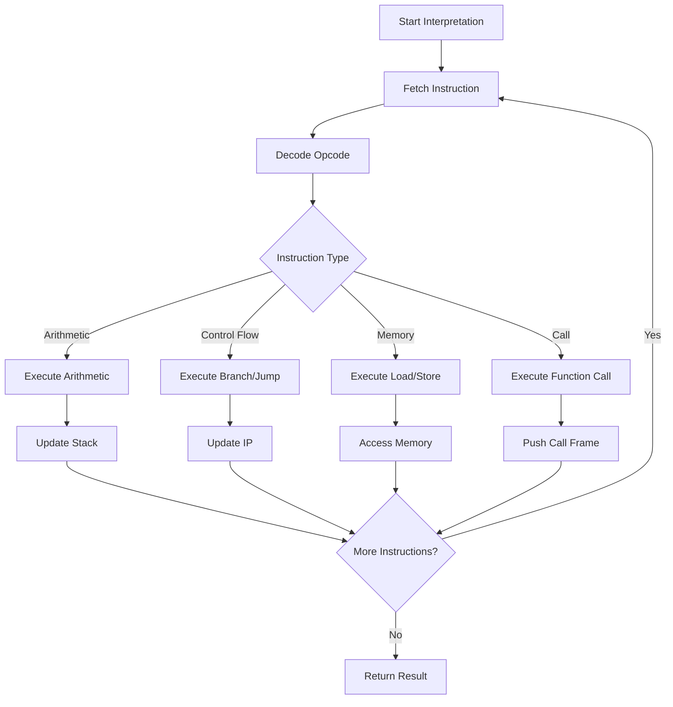
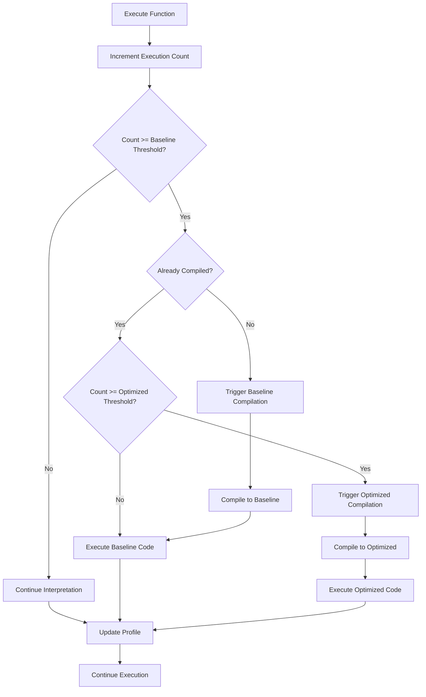
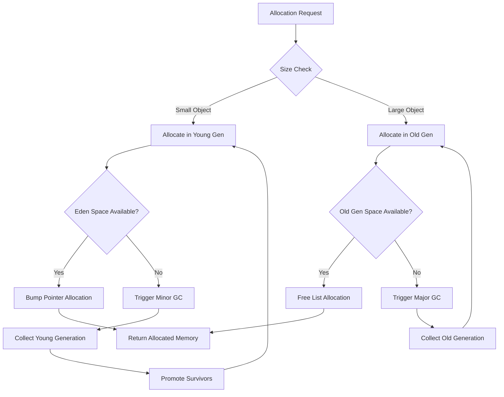

# VM Execution Flow

This diagram illustrates the execution flow within the BDI Virtual Machine.

## Execution Sequence



## Execution States

### State 1: Initialization


### State 2: Execution Mode Selection


## Detailed Execution Flow

### 1. Bytecode Interpretation



### 2. JIT Compilation Trigger



### 3. Memory Allocation Flow



## Performance Characteristics

### Execution Modes

| Mode | Startup Time | Execution Speed | Use Case |
|------|-------------|----------------|----------|
| Interpreter | 0 ms | 10-50x slower | Cold code, startup |
| Baseline JIT | 1-10 ms | 2-5x slower | Warm code |
| Optimized JIT | 10-100 ms | 0.8-1.2x native | Hot code |

### Transition Thresholds

```
Interpreter → Baseline JIT: 100 executions
Baseline JIT → Optimized JIT: 1000 executions
```

## Stack Frame Layout

```
┌─────────────────────────────────┐
│  Return Address                 │
├─────────────────────────────────┤
│  Previous Frame Pointer         │
├─────────────────────────────────┤
│  Local Variable N               │
│  Local Variable N-1             │
│  ...                            │
│  Local Variable 1               │
│  Local Variable 0               │
├─────────────────────────────────┤
│  Temporary Value M              │
│  Temporary Value M-1            │
│  ...                            │
│  Temporary Value 1              │
│  Temporary Value 0              │
└─────────────────────────────────┘
```

---

[Back to Architecture Overview](../README.md)
