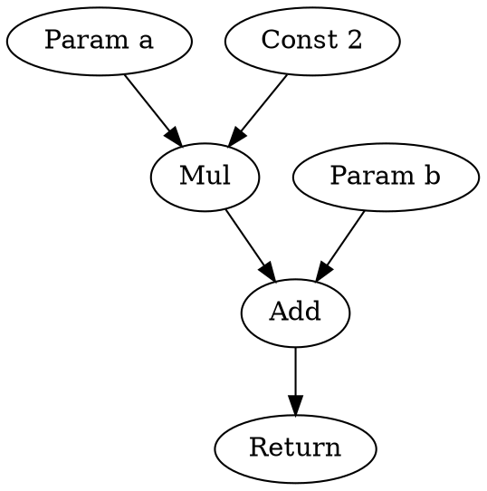

# Graph Optimizer Architecture

## Overview

The BDI Graph Optimizer performs optimization passes on the intermediate representation (IR) graph to improve execution performance. It uses a graph-based IR that enables powerful data flow and control flow optimizations.

## Graph-Based IR

### Why Graph-Based IR?

Traditional linear IRs (like LLVM IR or Java bytecode) represent programs as sequences of instructions. Graph-based IRs represent programs as directed graphs where:

- **Nodes** represent operations
- **Edges** represent data and control dependencies

**Advantages**:
- Natural representation of data flow
- Enables powerful optimizations
- Supports SSA (Static Single Assignment) form
- Facilitates analysis passes
- Allows parallel optimization

## Graph Structure

### Node Types

```c
typedef enum {
    NODE_CONSTANT,      // Constant value
    NODE_PARAMETER,     // Function parameter
    NODE_ADD,           // Addition
    NODE_SUB,           // Subtraction
    NODE_MUL,           // Multiplication
    NODE_DIV,           // Division
    NODE_LOAD,          // Memory load
    NODE_STORE,         // Memory store
    NODE_PHI,           // SSA phi node
    NODE_BRANCH,        // Conditional branch
    NODE_JUMP,          // Unconditional jump
    NODE_CALL,          // Function call
    NODE_RETURN,        // Function return
} NodeType;
```

### Node Structure

```c
typedef struct GraphNode {
    uint32_t id;                    // Unique node ID
    NodeType type;                  // Node type
    
    // Data edges (inputs)
    struct GraphNode** inputs;
    size_t input_count;
    
    // Data edges (outputs)
    struct GraphNode** outputs;
    size_t output_count;
    
    // Control edges
    struct GraphNode* control_input;
    struct GraphNode** control_outputs;
    size_t control_output_count;
    
    // Node data
    union {
        double constant_value;
        uint32_t parameter_index;
        uint32_t function_id;
    } data;
    
    // Metadata
    TypeInfo* type;
    SourceLocation* location;
} GraphNode;
```

### Edge Types

**Data Edges**:
- Represent value dependencies
- Connect producer to consumer
- Carry type information

**Control Edges**:
- Represent execution order
- Connect control flow operations
- Ensure correct sequencing

**Memory Edges**:
- Represent memory dependencies
- Prevent invalid reordering
- Maintain memory consistency

## Graph Construction

### From AST to Graph

The graph builder converts an Abstract Syntax Tree (AST) to a graph-based IR.

**Process**:
1. **Traverse AST**: Post-order traversal
2. **Create Nodes**: One node per AST node
3. **Establish Edges**: Connect nodes based on dependencies
4. **Insert Phi Nodes**: For SSA form
5. **Type Propagation**: Propagate type information

**Example**:

**AST**:
```
BinaryOp(+)
├─ BinaryOp(*)
│  ├─ Var(a)
│  └─ Const(2)
└─ Var(b)
```

**Graph**:
```
[Param a] ──┐
            ├─> [Mul] ──┐
[Const 2] ──┘           ├─> [Add] ──> [Return]
[Param b] ──────────────┘
```

### SSA Form

The graph uses Static Single Assignment (SSA) form where each variable is assigned exactly once.

**Phi Nodes**:
Phi nodes merge values from different control flow paths.

**Example**:
```c
if (condition) {
    x = a;
} else {
    x = b;
}
// x = phi(a, b)
```

**Graph Representation**:
```
[Condition] ──> [Branch]
                   ├─> [Block1: x = a]
                   └─> [Block2: x = b]
                          ↓
                   [Phi(a, b)] ──> [Use x]
```

## Optimization Passes

### Pass 1: Dead Code Elimination

Remove unreachable code and unused values.

**Algorithm**:
1. Mark all nodes reachable from entry
2. Mark all nodes used by marked nodes
3. Remove unmarked nodes

**Example**:
```c
// Before
int unused = 5 * 3;  // Dead code
int result = 2 + 2;
return result;

// After
int result = 2 + 2;
return result;
```

**Benefits**:
- Reduces code size
- Eliminates unnecessary computation
- Improves cache locality

### Pass 2: Constant Folding

Evaluate constant expressions at compile time.

**Algorithm**:
1. Identify nodes with constant inputs
2. Evaluate operation
3. Replace node with constant

**Example**:
```c
// Before
int x = 5 + 3;
int y = x * 2;

// After
int x = 8;
int y = 16;
```

**Benefits**:
- Eliminates runtime computation
- Reduces instruction count
- Enables further optimizations

### Pass 3: Constant Propagation

Propagate constant values through the program.

**Algorithm**:
1. Track constant values
2. Replace uses with constants
3. Trigger constant folding

**Example**:
```c
// Before
int x = 5;
int y = x + 3;
int z = y * 2;

// After
int x = 5;
int y = 8;
int z = 16;
```

**Benefits**:
- Exposes more constant folding opportunities
- Simplifies control flow
- Reduces variable usage

### Pass 4: Common Subexpression Elimination (CSE)

Eliminate redundant computations.

**Algorithm**:
1. Build value numbering table
2. Identify equivalent expressions
3. Reuse computed values

**Example**:
```c
// Before
int a = x + y;
int b = x + y;  // Redundant
int c = a + b;

// After
int a = x + y;
int b = a;      // Reuse
int c = a + a;
```

**Benefits**:
- Reduces computation
- Improves performance
- Reduces register pressure

### Pass 5: Loop Invariant Code Motion (LICM)

Move loop-invariant code outside loops.

**Algorithm**:
1. Identify loop structure
2. Find invariant computations
3. Move to loop preheader

**Example**:
```c
// Before
for (int i = 0; i < n; i++) {
    result[i] = array[i] * constant + offset;
    //          invariant: constant, offset
}

// After
temp = constant;
temp_offset = offset;
for (int i = 0; i < n; i++) {
    result[i] = array[i] * temp + temp_offset;
}
```

**Benefits**:
- Reduces loop overhead
- Improves performance
- Enables further optimizations

### Pass 6: Loop Unrolling

Replicate loop body to reduce loop overhead.

**Algorithm**:
1. Identify loops with known bounds
2. Replicate loop body N times
3. Adjust loop counter

**Example**:
```c
// Before
for (int i = 0; i < 4; i++) {
    result[i] = array[i] * 2;
}

// After (unrolled 4x)
result[0] = array[0] * 2;
result[1] = array[1] * 2;
result[2] = array[2] * 2;
result[3] = array[3] * 2;
```

**Benefits**:
- Reduces branch overhead
- Enables instruction-level parallelism
- Improves cache utilization

### Pass 7: Inlining

Replace function calls with function body.

**Algorithm**:
1. Identify inlining candidates
2. Copy function body to call site
3. Adjust parameters and returns

**Example**:
```c
// Before
int square(int x) { return x * x; }
int result = square(5);

// After
int result = 5 * 5;  // Inlined and folded
```

**Heuristics**:
- Inline small functions (< 50 instructions)
- Inline hot functions (frequently called)
- Don't inline recursive functions
- Consider code size impact

**Benefits**:
- Eliminates call overhead
- Enables interprocedural optimization
- Improves performance

### Pass 8: Strength Reduction

Replace expensive operations with cheaper equivalents.

**Algorithm**:
1. Identify expensive operations
2. Find cheaper equivalents
3. Replace operations

**Example**:
```c
// Before
int x = y * 2;
int z = a / 4;

// After
int x = y << 1;    // Shift instead of multiply
int z = a >> 2;    // Shift instead of divide
```

**Benefits**:
- Reduces instruction latency
- Improves performance
- Reduces power consumption

## Optimization Levels

### Level 0: No Optimization

- No optimization passes
- Fast compilation
- Useful for debugging

### Level 1: Basic Optimization

**Passes**:
- Dead code elimination
- Constant folding
- Basic constant propagation

**Characteristics**:
- Fast optimization
- Minimal code size increase
- Moderate performance improvement

### Level 2: Standard Optimization (Default)

**Passes**:
- All Level 1 passes
- Common subexpression elimination
- Loop invariant code motion
- Basic inlining

**Characteristics**:
- Balanced optimization
- Good performance improvement
- Reasonable compilation time

### Level 3: Aggressive Optimization

**Passes**:
- All Level 2 passes
- Loop unrolling
- Aggressive inlining
- Strength reduction
- Advanced loop optimizations

**Characteristics**:
- Maximum performance
- Longer compilation time
- Potential code size increase

## Graph Analysis

### Data Flow Analysis

Analyze how data flows through the program.

**Analyses**:
- **Reaching Definitions**: Which definitions reach each use
- **Live Variables**: Which variables are live at each point
- **Available Expressions**: Which expressions are available
- **Use-Def Chains**: Connect uses to definitions

### Control Flow Analysis

Analyze program control flow.

**Analyses**:
- **Dominance**: Which nodes dominate others
- **Post-Dominance**: Which nodes post-dominate others
- **Loop Detection**: Identify natural loops
- **Reducibility**: Check if CFG is reducible

### Dependency Analysis

Analyze dependencies between operations.

**Types**:
- **Data Dependencies**: True dependencies (RAW)
- **Anti-Dependencies**: Write-after-read (WAR)
- **Output Dependencies**: Write-after-write (WAW)
- **Control Dependencies**: Control flow dependencies

## Performance Characteristics

### Optimization Time

| Pass | Time Complexity | Typical Time |
|------|----------------|--------------|
| Dead Code Elimination | O(n) | 1-5 ms |
| Constant Folding | O(n) | 1-5 ms |
| CSE | O(n²) | 5-20 ms |
| LICM | O(n·d) | 5-20 ms |
| Inlining | O(n·m) | 10-50 ms |

Where:
- n = number of nodes
- d = loop depth
- m = number of call sites

### Performance Improvement

| Optimization Level | Speedup | Compilation Time |
|-------------------|---------|------------------|
| Level 0 | 1x | 0 ms |
| Level 1 | 1.5-2x | 5-10 ms |
| Level 2 | 2-4x | 10-30 ms |
| Level 3 | 3-6x | 30-100 ms |

## Graph Visualization

The optimizer can generate visualizations of the IR graph.

**Formats**:
- DOT (Graphviz)
- SVG
- PNG

**Example DOT Output**:


## API Usage

### Creating a Graph

```c
Graph* graph = graph_create();
GraphNode* param_a = graph_add_parameter(graph, 0);
GraphNode* const_2 = graph_add_constant(graph, 2.0);
GraphNode* mul = graph_add_binary_op(graph, NODE_MUL, param_a, const_2);
```

### Running Optimizations

```c
// Run all optimizations at level 2
graph_optimize(graph, OPTIMIZATION_LEVEL_2);

// Run specific pass
graph_optimize_pass(graph, PASS_CONSTANT_FOLDING);
```

### Executing Graph

```c
GraphExecutor* executor = graph_executor_create();
GraphExecutionResult result = graph_execute(graph, executor);
```

## Future Enhancements

### Planned Features

1. **Polyhedral Optimization**: Advanced loop optimization
2. **Auto-Vectorization**: Automatic SIMD code generation
3. **Profile-Guided Optimization**: Use runtime profiles
4. **Interprocedural Analysis**: Whole-program optimization
5. **Alias Analysis**: Improved memory optimization

### Research Directions

1. **Machine Learning-Guided Optimization**: Use ML to select optimization strategies
2. **Adaptive Optimization**: Dynamically adjust optimizations
3. **Quantum Circuit Optimization**: Optimize quantum circuits

## References

- [System Design](system-design.md)
- [VM Architecture](vm-architecture.md)
- [JIT Architecture](jit-architecture.md)
- [API Documentation](../api/html/index.html)

---

**BDI Kernel Team**  
**October 2024**
