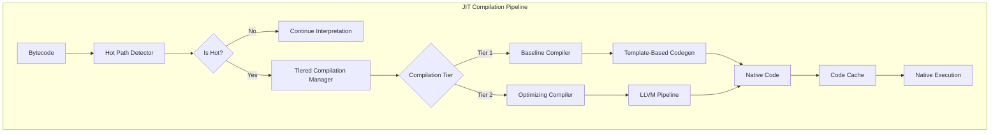

# JIT Compiler Architecture

## Overview

The BDI JIT (Just-In-Time) Compiler dynamically compiles hot code paths to native machine code for optimal performance. It uses a tiered compilation strategy with LLVM as the backend for code generation and optimization.

## JIT Design Philosophy

The JIT compiler balances three competing goals:

1. **Fast Startup**: Minimize compilation overhead for cold code
2. **Peak Performance**: Achieve near-native performance for hot code
3. **Adaptive Optimization**: Optimize based on runtime behavior

## Architecture Overview



## Core Components

### 1. JIT Compiler (jit_compiler.h)

The main JIT compiler manages the compilation process and code cache.

**Structure**:
```c
typedef struct {
    LLVMContextRef llvm_context;
    LLVMModuleRef module;
    LLVMBuilderRef builder;
    LLVMExecutionEngineRef engine;
    
    // Statistics
    uint64_t functions_compiled;
    uint64_t compilation_time_ns;
    uint64_t optimization_time_ns;
    
    // Configuration
    JITTier default_tier;
    bool enable_profiling;
    bool enable_inlining;
    uint32_t optimization_level;  // 0-3
} JITCompiler;
```

**Key Features**:
- LLVM-based code generation
- Multi-tier compilation support
- Code cache management
- Compilation statistics tracking

### 2. Hot Path Detector (hot_path.h)

Identifies hot code paths that benefit from JIT compilation.

**Detection Metrics**:
```c
typedef struct {
    uint32_t function_id;
    uint64_t execution_count;
    uint64_t total_time_ns;
    uint64_t average_time_ns;
    bool is_hot;
    JITTier current_tier;
} HotPathInfo;
```

**Detection Strategy**:
- Track execution count per function
- Measure execution time
- Calculate hotness score
- Trigger compilation at thresholds

**Thresholds**:
- **Baseline JIT**: 100 executions or 10ms cumulative time
- **Optimized JIT**: 1000 executions or 100ms cumulative time

### 3. Tiered Compilation Manager (tiered_compilation.h)

Manages the tiered compilation strategy.

**Compilation Tiers**:
```c
typedef enum {
    JIT_TIER_INTERPRETER = 0,  // No compilation
    JIT_TIER_BASELINE = 1,      // Fast compilation
    JIT_TIER_OPTIMIZED = 2,     // Full optimization
    JIT_TIER_MAX = 3
} JITTier;
```

**Tier Characteristics**:

| Tier | Compilation Time | Optimization | Performance |
|------|-----------------|--------------|-------------|
| Interpreter | 0 ms | None | 10-50x slower |
| Baseline | 1-10 ms | Minimal | 2-5x slower |
| Optimized | 10-100 ms | Full | 0.8-1.2x native |

### 4. Compiled Code Cache

Stores compiled native code for reuse.

**Cache Entry**:
```c
typedef struct {
    uint32_t function_id;
    CompiledFunction native_code;
    JITTier tier;
    uint64_t execution_count;
    uint64_t total_time_ns;
    bool needs_recompilation;
} CompiledCode;
```

**Cache Management**:
- LRU eviction policy
- Size-based limits
- Recompilation tracking
- Performance monitoring

## Compilation Pipeline

### Tier 1: Baseline Compilation

Fast compilation with minimal optimization for quick startup.

**Process**:
1. **Bytecode Analysis**: Analyze bytecode structure
2. **Template Selection**: Select code templates for each instruction
3. **Code Generation**: Generate native code from templates
4. **Linking**: Link generated code
5. **Caching**: Store in code cache

**Optimizations**:
- Simple register allocation
- Basic constant folding
- Direct instruction mapping
- No inlining

**Performance**:
- Compilation time: 1-10 ms per function
- Execution speed: 2-5x slower than native
- Memory overhead: ~1-2 KB per function

### Tier 2: Optimized Compilation

Full LLVM optimization pipeline for peak performance.

**Process**:
1. **IR Generation**: Convert bytecode to LLVM IR
2. **Optimization Passes**: Run LLVM optimization pipeline
3. **Code Generation**: Generate optimized native code
4. **Linking**: Link with runtime support
5. **Caching**: Store in code cache

**LLVM Optimization Passes**:
- **Scalar Optimizations**:
  - Constant propagation
  - Dead code elimination
  - Common subexpression elimination
  - Strength reduction
  
- **Loop Optimizations**:
  - Loop invariant code motion
  - Loop unrolling
  - Loop fusion
  - Vectorization
  
- **Interprocedural Optimizations**:
  - Inlining
  - Devirtualization
  - Constant propagation across functions
  
- **Code Generation**:
  - Register allocation
  - Instruction scheduling
  - Peephole optimization

**Performance**:
- Compilation time: 10-100 ms per function
- Execution speed: 0.8-1.2x native
- Memory overhead: ~5-10 KB per function

## Bytecode to LLVM IR Translation

### Translation Strategy

The JIT compiler translates BDI bytecode to LLVM IR for optimization.

**Example Translation**:

**Bytecode**:
```
PUSH 5
PUSH 3
ADD
RETURN
```

**LLVM IR**:
```llvm
define double @function() {
entry:
  %0 = alloca double
  %1 = alloca double
  store double 5.0, double* %0
  store double 3.0, double* %1
  %2 = load double, double* %0
  %3 = load double, double* %1
  %4 = fadd double %2, %3
  ret double %4
}
```

### Stack to SSA Conversion

The JIT compiler converts stack-based bytecode to SSA (Static Single Assignment) form.

**Process**:
1. Analyze stack operations
2. Track value flow
3. Insert phi nodes for merge points
4. Generate SSA IR

**Example**:

**Stack Operations**:
```
PUSH a
PUSH b
ADD
PUSH c
MUL
```

**SSA Form**:
```llvm
%1 = load double, double* %a
%2 = load double, double* %b
%3 = fadd double %1, %2
%4 = load double, double* %c
%5 = fmul double %3, %4
```

## Optimization Strategies

### 1. Inline Caching

Cache method lookups and type information for faster dispatch.

**Implementation**:
```c
typedef struct {
    void* cached_target;
    uint32_t cached_type_id;
    uint64_t hit_count;
    uint64_t miss_count;
} InlineCache;
```

**Process**:
1. First call: Perform lookup, cache result
2. Subsequent calls: Check cache, use if valid
3. Cache miss: Update cache with new target

### 2. Speculative Optimization

Optimize based on observed runtime behavior with deoptimization support.

**Speculation Types**:
- Type speculation (assume specific types)
- Value speculation (assume specific values)
- Control flow speculation (assume likely branches)

**Deoptimization**:
- Guard checks inserted in optimized code
- Fallback to interpreter on guard failure
- Recompile with updated assumptions

### 3. Escape Analysis

Determine if objects escape their allocation scope.

**Benefits**:
- Stack allocation for non-escaping objects
- Eliminate unnecessary allocations
- Reduce GC pressure

**Analysis**:
```c
bool object_escapes(Object* obj) {
    // Check if object is stored in heap
    // Check if object is passed to external functions
    // Check if object outlives its scope
    return escapes;
}
```

### 4. Loop Optimization

Optimize hot loops for maximum performance.

**Optimizations**:
- **Loop Invariant Code Motion**: Move invariant code outside loop
- **Loop Unrolling**: Reduce loop overhead
- **Vectorization**: Use SIMD instructions
- **Loop Fusion**: Combine adjacent loops

**Example**:

**Original**:
```c
for (int i = 0; i < n; i++) {
    result[i] = array[i] * constant + offset;
}
```

**Optimized**:
```c
// Loop invariant code motion
temp = constant;
temp_offset = offset;

// Vectorization (4-wide SIMD)
for (int i = 0; i < n; i += 4) {
    __m256d a = _mm256_load_pd(&array[i]);
    __m256d r = _mm256_fmadd_pd(a, temp_vec, offset_vec);
    _mm256_store_pd(&result[i], r);
}
```

## Code Generation

### Native Code Generation

The JIT compiler generates native machine code for the target architecture.

**Supported Architectures**:
- x86-64 (primary)
- ARM64 (secondary)
- RISC-V (experimental)

**Code Generation Process**:
1. LLVM IR → Machine IR
2. Register allocation
3. Instruction selection
4. Instruction scheduling
5. Machine code emission

### Calling Convention

The JIT compiler uses a custom calling convention for efficiency.

**Convention**:
```c
typedef int64_t (*CompiledFunction)(
    void* context,      // VM context
    int64_t* args,      // Arguments array
    size_t arg_count    // Number of arguments
);
```

**Register Usage** (x86-64):
- `rdi`: VM context pointer
- `rsi`: Arguments array pointer
- `rdx`: Argument count
- `rax`: Return value
- `r12-r15`: Callee-saved (VM state)

### Runtime Support

The JIT compiler generates calls to runtime support functions.

**Support Functions**:
- Memory allocation
- Garbage collection
- Type checking
- Exception handling
- Debugging support

## Performance Characteristics

### Compilation Performance

| Tier | Time per Function | Throughput |
|------|------------------|------------|
| Baseline | 1-10 ms | 100-1000 functions/sec |
| Optimized | 10-100 ms | 10-100 functions/sec |

### Execution Performance

| Tier | Relative Performance | Speedup vs Interpreter |
|------|---------------------|----------------------|
| Interpreter | 1x | 1x |
| Baseline JIT | 5-10x | 5-10x |
| Optimized JIT | 20-50x | 20-50x |

### Memory Overhead

| Component | Memory per Function |
|-----------|-------------------|
| Baseline Code | 1-2 KB |
| Optimized Code | 5-10 KB |
| Metadata | 0.5-1 KB |
| LLVM Infrastructure | 10-50 MB (shared) |

## Profiling and Statistics

### Compilation Statistics

```c
void jit_compiler_get_stats(
    const JITCompiler* compiler,
    uint64_t* functions_compiled,
    uint64_t* compilation_time_ns,
    uint64_t* optimization_time_ns
);
```

**Tracked Metrics**:
- Total functions compiled
- Compilation time (baseline + optimized)
- Optimization time
- Code cache size
- Cache hit rate

### Execution Statistics

```c
typedef struct {
    uint64_t execution_count;
    uint64_t total_time_ns;
    uint64_t average_time_ns;
    uint64_t min_time_ns;
    uint64_t max_time_ns;
} ExecutionStats;
```

## Configuration

### Optimization Levels

```c
void jit_compiler_set_optimization_level(JITCompiler* compiler, uint32_t level);
```

**Levels**:
- **Level 0**: No optimization (baseline only)
- **Level 1**: Basic optimization
- **Level 2**: Standard optimization (default)
- **Level 3**: Aggressive optimization

### Feature Flags

```c
void jit_compiler_enable_profiling(JITCompiler* compiler, bool enable);
void jit_compiler_enable_inlining(JITCompiler* compiler, bool enable);
```

**Configurable Features**:
- Profiling
- Inlining
- Speculative optimization
- Loop optimization
- Vectorization

## Debugging Support

### Debug Information

The JIT compiler can generate debug information for compiled code.

**Debug Info**:
- Source line mapping
- Variable names and types
- Stack frame information
- Breakpoint support

### Disassembly

The JIT compiler can disassemble generated native code.

```c
void jit_disassemble(CompiledCode* code, FILE* output);
```

**Output Format**:
```
0x00000000: push   rbp
0x00000001: mov    rbp, rsp
0x00000004: sub    rsp, 0x20
0x00000008: mov    rax, [rdi]
...
```

## Error Handling

### Compilation Errors

```c
typedef enum {
    JIT_STATUS_SUCCESS = 0,
    JIT_STATUS_ERROR_INIT = 1,
    JIT_STATUS_ERROR_COMPILE = 2,
    JIT_STATUS_ERROR_OPTIMIZE = 3,
    JIT_STATUS_ERROR_EXECUTE = 4
} JITStatus;
```

**Error Recovery**:
- Fallback to interpreter on compilation failure
- Log compilation errors
- Retry with lower optimization level

## Future Enhancements

### Planned Features

1. **Profile-Guided Optimization**: Use runtime profiles for better optimization
2. **Adaptive Compilation**: Dynamically adjust compilation strategy
3. **Deoptimization**: Support for speculative optimization with fallback
4. **Cross-Function Optimization**: Optimize across function boundaries
5. **GPU Code Generation**: Generate GPU kernels for data-parallel code

### Research Directions

1. **Machine Learning-Guided Optimization**: Use ML to predict optimal compilation strategy
2. **Quantum JIT**: JIT compilation for quantum circuits
3. **Neuromorphic Code Generation**: Generate code for neuromorphic hardware

## References

- [System Design](system-design.md)
- [VM Architecture](vm-architecture.md)
- [Graph Optimizer](graph-optimizer.md)
- [API Documentation](../api/html/index.html)
- [LLVM Documentation](https://llvm.org/docs/)

---

**BDI Kernel Team**  
**October 2024**
