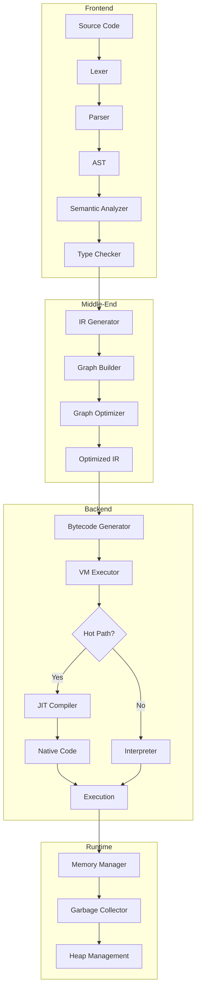

# BDI Kernel System Design

## Overview

This document provides a detailed technical description of the BDI Kernel system architecture, including component interactions, data flows, and design decisions.

## System Architecture

### High-Level Architecture



## Component Architecture

### 1. Compiler Frontend

The compiler frontend is responsible for transforming source code into an intermediate representation.

#### Lexer (Tokenization)

**Purpose**: Convert source code text into a stream of tokens.

**Key Components**:
- Token recognition
- Keyword identification
- Operator parsing
- Literal value extraction
- Comment handling

**Implementation**: `C/compiler/lexer/`

#### Parser (Syntax Analysis)

**Purpose**: Build an Abstract Syntax Tree (AST) from the token stream.

**Key Components**:
- Recursive descent parser
- Operator precedence handling
- Error recovery
- AST node construction

**Implementation**: `C/compiler/parser/`

#### Semantic Analyzer

**Purpose**: Perform semantic analysis on the AST.

**Key Components**:
- Symbol table management
- Type inference and checking
- Scope resolution
- Control flow analysis
- Data flow analysis

**Implementation**: `C/compiler/semantic_analyzer/`

### 2. Intermediate Representation (IR)

The IR is a graph-based representation that serves as the foundation for optimization and code generation.

#### Graph Structure

**Node Types**:
- **Operation Nodes**: Arithmetic, logical, comparison operations
- **Control Flow Nodes**: Branches, loops, function calls
- **Memory Nodes**: Load, store, allocation
- **Constant Nodes**: Literal values
- **Phi Nodes**: SSA form merge points

**Edge Types**:
- **Data Edges**: Value dependencies
- **Control Edges**: Execution order
- **Memory Edges**: Memory dependencies

#### Graph Builder

**Purpose**: Convert AST to graph-based IR.

**Process**:
1. Traverse AST in post-order
2. Create IR nodes for each AST node
3. Establish data and control dependencies
4. Insert phi nodes for SSA form
5. Perform initial type propagation

**Implementation**: `C/vm/graph/graph_builder.h`

### 3. Graph Optimizer

The graph optimizer performs multiple optimization passes on the IR graph.

#### Optimization Passes

**Pass 1: Dead Code Elimination**
- Remove unreachable code
- Eliminate unused values
- Prune dead branches

**Pass 2: Constant Folding**
- Evaluate constant expressions at compile time
- Propagate constant values
- Simplify arithmetic operations

**Pass 3: Common Subexpression Elimination**
- Identify redundant computations
- Reuse computed values
- Reduce computation overhead

**Pass 4: Loop Optimization**
- Loop invariant code motion
- Loop unrolling
- Loop fusion and fission

**Pass 5: Inlining**
- Inline small functions
- Reduce call overhead
- Enable further optimizations

**Implementation**: `C/vm/graph/graph_optimizer.h`

### 4. Virtual Machine (VM)

The VM provides the execution environment for BDI bytecode.

#### VM Architecture

**Components**:
- **Instruction Pointer (IP)**: Points to current instruction
- **Value Stack**: Operand stack for computation
- **Call Stack**: Function call frames
- **Heap**: Dynamic memory allocation
- **Global Memory**: Static data storage

**Execution Model**:
- Stack-based architecture
- Bytecode interpretation
- Integration with JIT compiler
- Garbage collection integration

**Implementation**: `C/vm/`

#### Bytecode Format

**Instruction Format**:
```
[Opcode (1 byte)] [Operands (0-8 bytes)]
```

**Instruction Categories**:
- **Arithmetic**: ADD, SUB, MUL, DIV, MOD
- **Logical**: AND, OR, XOR, NOT
- **Comparison**: EQ, NE, LT, LE, GT, GE
- **Control Flow**: JUMP, BRANCH, CALL, RETURN
- **Memory**: LOAD, STORE, ALLOC, FREE
- **Stack**: PUSH, POP, DUP, SWAP

### 5. JIT Compiler

The JIT compiler dynamically compiles hot code paths to native machine code.

#### Tiered Compilation

**Tier 0: Interpreter**
- Pure interpretation
- Profiling and hot path detection
- Minimal overhead

**Tier 1: Baseline JIT**
- Fast compilation
- Minimal optimization
- Template-based code generation

**Tier 2: Optimized JIT**
- Full LLVM optimization pipeline
- Aggressive inlining
- Register allocation
- Instruction scheduling

#### Hot Path Detection

**Metrics**:
- Execution count threshold
- Time spent in function
- Loop iteration count
- Call frequency

**Strategy**:
- Profile during interpretation
- Identify hot functions and loops
- Trigger compilation at threshold
- Replace interpreted code with native code

**Implementation**: `C/vm/jit/`

### 6. Memory Management

Sophisticated memory management with automatic garbage collection.

#### Memory Layout

```
┌─────────────────────────────────────┐
│         Stack (grows down)          │
├─────────────────────────────────────┤
│              ↓                      │
│                                     │
│              ↑                      │
├─────────────────────────────────────┤
│         Heap (grows up)             │
│  ┌──────────────────────────────┐  │
│  │   Young Generation (Nursery) │  │
│  ├──────────────────────────────┤  │
│  │   Old Generation             │  │
│  └──────────────────────────────┘  │
└─────────────────────────────────────┘
```

#### Generational Garbage Collection

**Young Generation (Nursery)**:
- Fast allocation (bump pointer)
- Frequent collection
- Short-lived objects
- Copy collection algorithm

**Old Generation**:
- Infrequent collection
- Long-lived objects
- Mark-and-sweep algorithm
- Compaction (optional)

**Write Barriers**:
- Track old-to-young references
- Enable generational collection
- Minimal overhead

**Implementation**: `C/vm/gc/`

## Data Flow

### Compilation Pipeline

```
Source Code
    ↓
[Lexer] → Tokens
    ↓
[Parser] → AST
    ↓
[Semantic Analysis] → Typed AST
    ↓
[IR Generation] → IR Graph
    ↓
[Graph Optimization] → Optimized IR
    ↓
[Bytecode Generation] → Bytecode
    ↓
[VM Execution]
```

### Execution Pipeline

```
Bytecode
    ↓
[VM Interpreter]
    ↓
[Profiler] → Hot Path Detection
    ↓
[JIT Compiler] → Native Code
    ↓
[Native Execution]
```

## Design Decisions

### 1. Stack-Based VM

**Decision**: Use a stack-based VM architecture.

**Rationale**:
- Simpler bytecode format
- Easier to generate from AST
- Compact bytecode representation
- Well-understood execution model

**Trade-offs**:
- More stack operations than register-based
- Slightly lower performance in interpreter
- Mitigated by JIT compilation

### 2. Graph-Based IR

**Decision**: Use a graph-based intermediate representation.

**Rationale**:
- Natural representation for data flow
- Enables powerful optimizations
- Supports SSA form
- Facilitates analysis passes

**Trade-offs**:
- More complex than linear IR
- Higher memory overhead
- More sophisticated algorithms required

### 3. Tiered Compilation

**Decision**: Implement multi-tier JIT compilation.

**Rationale**:
- Balance compilation time and execution speed
- Adaptive optimization based on runtime behavior
- Minimize startup latency
- Maximize peak performance

**Trade-offs**:
- More complex implementation
- Additional memory for multiple code versions
- Profiling overhead

### 4. Generational GC

**Decision**: Use generational garbage collection.

**Rationale**:
- Most objects die young (generational hypothesis)
- Frequent collection of young generation
- Infrequent collection of old generation
- Low pause times

**Trade-offs**:
- Write barrier overhead
- More complex implementation
- Memory overhead for metadata

### 5. LLVM Backend

**Decision**: Use LLVM for optimized JIT compilation.

**Rationale**:
- Mature, well-tested optimization pipeline
- Multiple target architectures
- State-of-the-art code generation
- Active development and support

**Trade-offs**:
- Large dependency
- Compilation time overhead
- Memory footprint

## Performance Characteristics

### Compilation Performance

| Stage | Time (typical) | Memory |
|-------|---------------|--------|
| Lexing | 0.1-1 ms | 1-10 KB |
| Parsing | 1-10 ms | 10-100 KB |
| Semantic Analysis | 5-50 ms | 50-500 KB |
| IR Generation | 2-20 ms | 20-200 KB |
| Graph Optimization | 10-100 ms | 100 KB-1 MB |
| Bytecode Generation | 1-10 ms | 10-100 KB |

### Execution Performance

| Mode | Performance | Compilation Time |
|------|------------|------------------|
| Interpreter | 10-50x slower | 0 ms |
| Baseline JIT | 2-5x slower | 1-10 ms |
| Optimized JIT | 0.8-1.2x native | 10-100 ms |

### Memory Usage

| Component | Memory Overhead |
|-----------|----------------|
| VM State | 1-2 KB |
| Stack | 1-10 KB |
| Heap | Variable |
| JIT Compiler | 10-50 MB |
| GC Metadata | 10-20% of heap |

## Scalability

### Vertical Scalability

- **Program Size**: Supports programs with millions of nodes
- **Memory**: Efficient memory management with GC
- **Compilation**: Incremental compilation support

### Horizontal Scalability

- **Parallelism**: Multi-threaded JIT compilation
- **Concurrency**: Thread-safe VM instances
- **Distribution**: Future support for distributed execution

## Error Handling

### Compile-Time Errors

- Syntax errors with precise location
- Type errors with detailed messages
- Semantic errors with suggestions
- Warning system for potential issues

### Runtime Errors

- Stack overflow detection
- Out-of-memory handling
- Division by zero
- Null pointer dereference
- Array bounds checking

## Testing Strategy

### Unit Tests

- Component-level testing
- API contract verification
- Edge case coverage

### Integration Tests

- End-to-end compilation and execution
- Component interaction testing
- Performance regression testing

### Stress Tests

- Large program handling
- Memory pressure scenarios
- Long-running execution
- Concurrent execution

## Future Enhancements

### Planned Features

1. **Advanced Optimizations**
   - Profile-guided optimization
   - Speculative optimization
   - Adaptive optimization

2. **Hardware Support**
   - GPU execution
   - FPGA acceleration
   - SIMD vectorization

3. **Language Features**
   - Concurrent programming primitives
   - Module system
   - Foreign function interface

4. **Tooling**
   - Debugger integration
   - Profiler tools
   - Visualization tools

## References

- [VM Architecture](vm-architecture.md)
- [JIT Architecture](jit-architecture.md)
- [Graph Optimizer](graph-optimizer.md)
- [Memory Model](memory-model.md)
- [API Documentation](../api/html/index.html)

---

**BDI Kernel Team**  
**October 2024**
