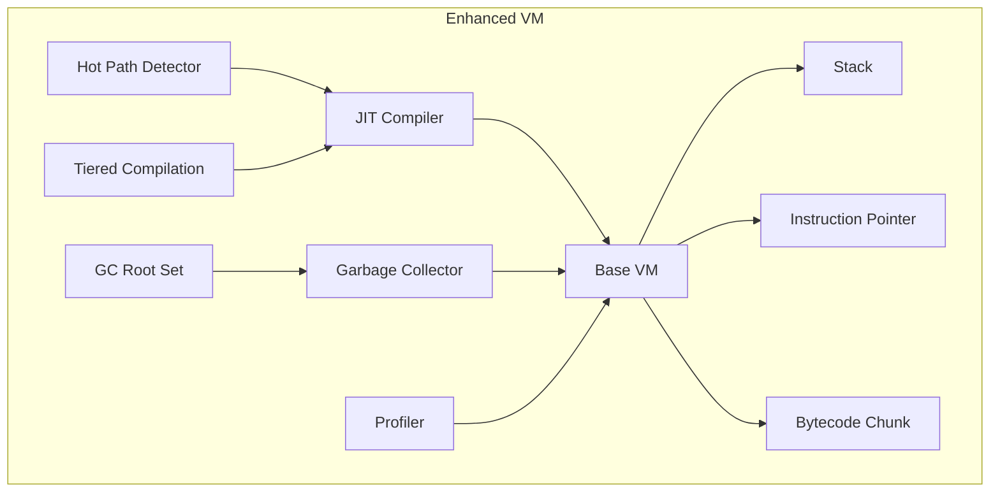

# Virtual Machine Architecture

## Overview

The BDI Virtual Machine (VM) is the execution engine that interprets and executes BDI bytecode. It provides a stack-based execution model with integrated JIT compilation and garbage collection.

## VM Design

### Architecture Overview



## Core Components

### 1. Base VM (bci_vm.h)

The base VM provides the fundamental execution environment.

**Structure**:
```c
typedef struct {
    Chunk* chunk;               // Bytecode chunk
    uint8_t* ip;                // Instruction pointer
    double stack[STACK_MAX];    // Value stack
    double* stack_top;          // Stack top pointer
} VM;
```

**Key Features**:
- Stack-based execution model
- Bytecode interpretation
- Simple and efficient design
- Foundation for enhanced features

### 2. Enhanced VM (vm.h)

The enhanced VM extends the base VM with JIT compilation and garbage collection.

**Structure**:
```c
typedef struct {
    VM* base_vm;                              // Base VM
    
    // JIT compilation
    JITCompiler* jit_compiler;
    HotPathDetector* hot_path_detector;
    TieredCompilationManager* tiered_compilation;
    
    // Garbage collection
    GenerationalGC* gc;
    GCRootSet* gc_roots;
    
    // Configuration
    bool enable_jit;
    bool enable_gc;
    bool enable_profiling;
    
    // Statistics
    uint64_t total_executions;
    uint64_t jit_executions;
    uint64_t interpreter_executions;
} EnhancedVM;
```

## Execution Model

### Stack-Based Architecture

The VM uses a stack-based execution model where operands are pushed onto and popped from a value stack.

**Example Execution**:
```
Bytecode: PUSH 5, PUSH 3, ADD

Stack Evolution:
[]           // Initial
[5]          // After PUSH 5
[5, 3]       // After PUSH 3
[8]          // After ADD
```

**Advantages**:
- Simple bytecode format
- Compact representation
- Easy to generate from AST
- Well-understood execution model

**Trade-offs**:
- More stack operations than register-based
- Slightly lower interpreter performance
- Mitigated by JIT compilation

### Instruction Execution

**Execution Loop**:
```c
while (true) {
    uint8_t instruction = *vm->ip++;
    
    switch (instruction) {
        case OP_ADD:
            double b = vm_stack_pop(vm);
            double a = vm_stack_pop(vm);
            vm_stack_push(vm, a + b);
            break;
        
        case OP_RETURN:
            return INTERPRET_OK;
        
        // ... other instructions
    }
}
```

### Instruction Set

**Arithmetic Operations**:
- `OP_ADD`: Addition
- `OP_SUB`: Subtraction
- `OP_MUL`: Multiplication
- `OP_DIV`: Division
- `OP_MOD`: Modulo
- `OP_NEG`: Negation

**Logical Operations**:
- `OP_AND`: Logical AND
- `OP_OR`: Logical OR
- `OP_XOR`: Logical XOR
- `OP_NOT`: Logical NOT

**Comparison Operations**:
- `OP_EQ`: Equal
- `OP_NE`: Not equal
- `OP_LT`: Less than
- `OP_LE`: Less than or equal
- `OP_GT`: Greater than
- `OP_GE`: Greater than or equal

**Control Flow**:
- `OP_JUMP`: Unconditional jump
- `OP_JUMP_IF_FALSE`: Conditional jump
- `OP_CALL`: Function call
- `OP_RETURN`: Function return

**Stack Operations**:
- `OP_PUSH`: Push constant
- `OP_POP`: Pop value
- `OP_DUP`: Duplicate top value
- `OP_SWAP`: Swap top two values

**Memory Operations**:
- `OP_LOAD`: Load from memory
- `OP_STORE`: Store to memory
- `OP_ALLOC`: Allocate memory
- `OP_FREE`: Free memory

## JIT Integration

### Hot Path Detection

The VM profiles execution to identify hot code paths for JIT compilation.

**Detection Strategy**:
```c
typedef struct {
    uint32_t function_id;
    uint64_t execution_count;
    uint64_t total_time_ns;
    bool is_hot;
} HotPathInfo;
```

**Thresholds**:
- **Baseline JIT**: 100 executions
- **Optimized JIT**: 1000 executions

**Process**:
1. Profile function execution
2. Track execution count and time
3. Trigger compilation at threshold
4. Replace interpreted code with native code

### Tiered Compilation

The VM uses a tiered compilation strategy for optimal performance.

**Tier 0: Interpreter**
- Pure interpretation
- Profiling enabled
- Minimal overhead
- Identifies hot paths

**Tier 1: Baseline JIT**
- Fast compilation (1-10 ms)
- Minimal optimization
- Template-based code generation
- 2-5x faster than interpreter

**Tier 2: Optimized JIT**
- Full LLVM optimization (10-100 ms)
- Aggressive inlining
- Register allocation
- Near-native performance (0.8-1.2x)

**Transition Strategy**:
```
Interpreter → (100 executions) → Baseline JIT
Baseline JIT → (1000 executions) → Optimized JIT
```

### Execution Switching

The VM seamlessly switches between interpreted and compiled execution.

**Process**:
1. Check if function has compiled code
2. If yes, execute native code
3. If no, execute bytecode
4. Update profiling information

**Implementation**:
```c
bool enhanced_vm_execute(EnhancedVM* vm, const Chunk* chunk) {
    // Check for compiled code
    CompiledCode* code = jit_get_compiled_code(vm->jit_compiler, function_id);
    
    if (code != NULL) {
        // Execute native code
        return jit_execute(vm->jit_compiler, code);
    } else {
        // Execute bytecode
        return vm_interpret(vm->base_vm, chunk);
    }
}
```

## Garbage Collection Integration

### GC-Aware Allocation

The VM integrates with the garbage collector for automatic memory management.

**Allocation Functions**:
```c
void* vm_alloc(EnhancedVM* vm, size_t size);
void* vm_alloc_object(EnhancedVM* vm, size_t size, uint32_t type_id);
```

**Process**:
1. Request allocation from GC
2. Check if collection needed
3. Allocate from nursery (young generation)
4. Track allocation in GC metadata

### Write Barriers

Write barriers track references from old to young generation.

**Implementation**:
```c
void vm_write_barrier(EnhancedVM* vm, void* old_obj, void* new_value) {
    if (is_old_generation(old_obj) && is_young_generation(new_value)) {
        gc_record_old_to_young_ref(vm->gc, old_obj, new_value);
    }
}
```

### Root Set Management

The VM maintains a root set for garbage collection.

**Root Types**:
- Stack values
- Global variables
- JIT-compiled code references
- Active function frames

**Management**:
```c
void vm_register_root(EnhancedVM* vm, GCObject** root);
void vm_unregister_root(EnhancedVM* vm, GCObject** root);
```

## Memory Layout

### VM Memory Structure

```
┌─────────────────────────────────────┐
│         VM Instance                  │
├─────────────────────────────────────┤
│  Base VM (1-2 KB)                   │
│  ├─ Stack (256 doubles = 2 KB)     │
│  ├─ Instruction Pointer (8 bytes)  │
│  └─ Chunk Pointer (8 bytes)        │
├─────────────────────────────────────┤
│  JIT Compiler (10-50 MB)            │
│  ├─ LLVM Context                    │
│  ├─ Code Cache                      │
│  └─ Compilation Metadata            │
├─────────────────────────────────────┤
│  Garbage Collector                  │
│  ├─ Young Generation (configurable) │
│  ├─ Old Generation (configurable)   │
│  └─ GC Metadata (10-20% overhead)   │
└─────────────────────────────────────┘
```

### Stack Layout

```
┌─────────────────────────────────────┐
│  Stack Top (stack_top)              │
├─────────────────────────────────────┤
│  Value N                            │
│  Value N-1                          │
│  ...                                │
│  Value 2                            │
│  Value 1                            │
│  Value 0                            │
├─────────────────────────────────────┤
│  Stack Base (stack[0])              │
└─────────────────────────────────────┘
```

## Performance Characteristics

### Execution Performance

| Mode | Performance | Compilation Time |
|------|------------|------------------|
| Interpreter | 10-50x slower than native | 0 ms |
| Baseline JIT | 2-5x slower than native | 1-10 ms |
| Optimized JIT | 0.8-1.2x native | 10-100 ms |

### Memory Usage

| Component | Memory |
|-----------|--------|
| VM State | 1-2 KB |
| Stack | 2 KB (256 doubles) |
| JIT Compiler | 10-50 MB |
| GC Metadata | 10-20% of heap |

### Throughput

- **Interpreter**: ~10-100 million instructions/second
- **Baseline JIT**: ~100-500 million instructions/second
- **Optimized JIT**: ~500-2000 million instructions/second

## Configuration

### VM Creation

```c
// Create with default heap size
EnhancedVM* vm = enhanced_vm_create(1024 * 1024);  // 1 MB heap

// Create with custom sizes
EnhancedVM* vm = enhanced_vm_create_with_sizes(
    256 * 1024,   // 256 KB nursery
    768 * 1024    // 768 KB old generation
);
```

### Feature Configuration

```c
// Enable/disable JIT compilation
enhanced_vm_enable_jit(vm, true);

// Enable/disable garbage collection
enhanced_vm_enable_gc(vm, true);

// Enable/disable profiling
enhanced_vm_enable_profiling(vm, true);
```

## Statistics and Monitoring

### Execution Statistics

```c
uint64_t total_executions;
uint64_t jit_executions;
uint64_t interpreter_executions;

enhanced_vm_get_stats(vm, 
    &total_executions,
    &jit_executions,
    &interpreter_executions
);
```

### GC Statistics

```c
uint64_t gc_collections;
uint64_t gc_bytes_allocated;
uint64_t gc_bytes_freed;
size_t young_used;
size_t old_used;

enhanced_vm_get_gc_stats(vm,
    &gc_collections,
    &gc_bytes_allocated,
    &gc_bytes_freed,
    &young_used,
    &old_used
);
```

## Error Handling

### Runtime Errors

- **Stack Overflow**: Detected when stack_top exceeds STACK_MAX
- **Stack Underflow**: Detected when popping from empty stack
- **Division by Zero**: Checked before division operations
- **Invalid Instruction**: Detected in execution loop
- **Out of Memory**: Reported by garbage collector

### Error Reporting

```c
typedef enum {
    INTERPRET_OK,
    INTERPRET_COMPILE_ERROR,
    INTERPRET_RUNTIME_ERROR
} InterpretResult;
```

## Future Enhancements

### Planned Features

1. **Register-Based VM**: Optional register-based execution mode
2. **Parallel Execution**: Multi-threaded VM instances
3. **Distributed Execution**: Support for distributed programs
4. **Advanced Profiling**: More detailed profiling information
5. **Debugging Support**: Integrated debugger interface

### Optimization Opportunities

1. **Inline Caching**: Cache method lookups
2. **Speculative Optimization**: Optimize based on type speculation
3. **Escape Analysis**: Stack-allocate non-escaping objects
4. **SIMD Operations**: Vectorized execution for data-parallel code

## References

- [System Design](system-design.md)
- [JIT Architecture](jit-architecture.md)
- [Memory Model](memory-model.md)
- [API Documentation](../api/html/index.html)

---

**BDI Kernel Team**  
**October 2024**
